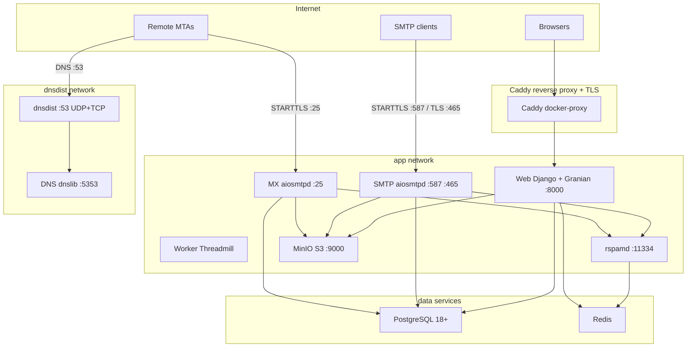
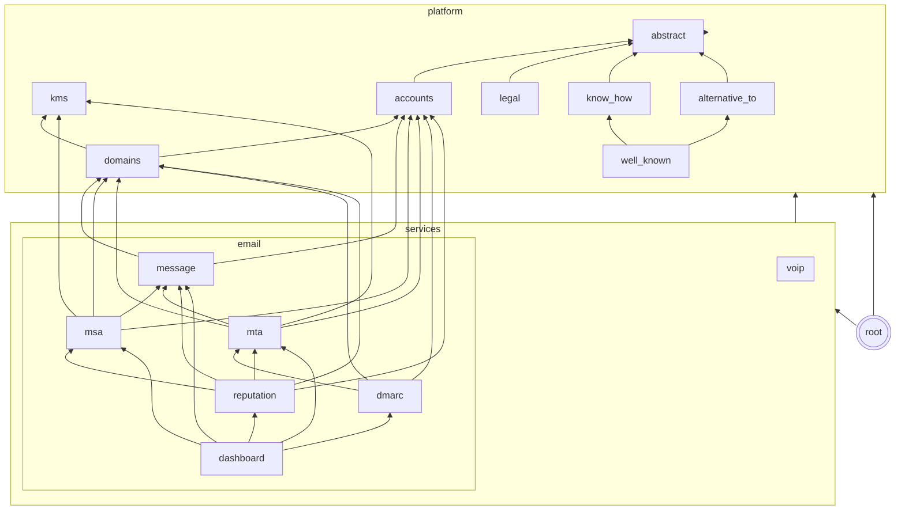

# relay: Developer-First IT Infrastructure

A developer-first IT infrastructure provider. We build superior products and
enable our clients to build AAA applications on top of them.

## Managed Sender Domain

Every organization gets a **managed sender domain**. It is a subdomain of the
platform domain, and relay manages it automatically. The domain is
derived from the platform domain as `open.{RELAY_PLATFORM_DOMAIN}` (for
example `open.localhost` in development).
When an organization is created, a `Domain` is auto-created with the name
`{org.slug}.{RELAY_MANAGED_SENDER_DOMAIN}` (for example `acme.open.localhost`).
The domain is DKIM-signed and pre-verified. No user DNS configuration needed.

The managed domain cannot be deleted from the dashboard. Users can still add
their own delegated domains alongside it.

### Operator setup

The platform operator must set up the following records on the
`RELAY_PLATFORM_DOMAIN` nameserver:

1. **NS delegation for `open.{platform_domain}`**. Add NS records for the
   `open` subdomain pointing to `RELAY_DNS_NS_NAMESERVERS` (for example,
   `ns1.{platform_domain}`, `ns2.{platform_domain}`).
1. **A/AAAA record for the web server**. The platform domain itself needs
   an A/AAAA record for the web UI.
1. **Forward DNS for the SMTP server**. Set `RELAY_DNS_SMTP_IPS`. The
   public hostname (`smtp.{platform_domain}`) and sender subdomains resolve
   to the SMTP server IPs.
1. **Reverse DNS for every SMTP server IP**. Configure each IP owner's PTR
   record with the hosting provider. Outbound SMTP must use the corresponding
   hostname for EHLO.
1. **SPF include**. The `spf.{platform_domain}` TXT record must list the
   SMTP server IP addresses.
1. **DMARC**. `_dmarc.{platform_domain}` TXT record.
1. **MTA-STS**. `_mta-sts.{platform_domain}` TXT record and
   `mta-sts.{platform_domain}` CNAME.
1. **TLS-RPT**. `_smtp._tls.{platform_domain}` TXT record.

All per-org records (MX, SPF, DKIM, DMARC, TLS-RPT, MTA-STS) for managed
domains are served automatically by the internal nameserver. No
per-domain delegation is necessary.

## Reputation limits

Reputation limits apply **per account (organization)**, not per domain,
because bounces and complaints affect the platform's sending IPs. The
reputation page in the sidebar shows the lock status and the current rates.

A rolling window counts every outgoing message of the account and, against
it:

- **Hard bounces**. Transmissions the receiving server rejected with an SMTP
  5xx response. Soft bounces (4xx) are shown but do not count.
- **Complaints**. Feedback loop reports received from email providers, plus
  outgoing messages relay holds as spam.

Once an account has sent at least `RELAY_REPUTATION_MIN_VOLUME` messages in
the window, it locks when the hard-bounce rate or the complaint rate exceeds
its threshold. A lock never clears automatically. A locked account cannot
send: new SMTP submissions are rejected with
`550 Account locked due to sender reputation`, and queued messages are
dropped. Org admins and platform staff receive an email when an account
locks. Staff unlock the account with the **Unlock reputation** action on the
organization page in the Django admin.

| Variable                                    | Default | Description                                |
| ------------------------------------------- | ------- | ------------------------------------------ |
| `RELAY_REPUTATION_BOUNCE_RATE_THRESHOLD`    | `0.05`  | Hard-bounce rate that locks the account.   |
| `RELAY_REPUTATION_COMPLAINT_RATE_THRESHOLD` | `0.001` | Complaint rate that locks the account.     |
| `RELAY_REPUTATION_WINDOW_DAYS`              | `7`     | Rolling window length in days.             |
| `RELAY_REPUTATION_MIN_VOLUME`               | `100`   | Messages required before thresholds apply. |

## Architecture

```
Organization → Domain, SmtpCredential
```

- **Organization**: Owns resources (domains, credentials). Each user gets a personal org on signup.
- **Domain**: Root domain verified once with NS delegation + DMARC. Holds shared DKIM keys.
- **SendingDomain**: Envelope-from domain (for example, acme.com or app.acme.com) with SPF + DKIM CNAME. Shares the root domain's NS delegation.
- **ReceivingDomain**: Receiving domain with MX record pointing to the root domain's sender subdomain
- **SmtpCredential**: Per-org API key used to authenticate outgoing SMTP submissions
- **Webhook**: Per-org HTTPS endpoint with Ed25519 keypair for signing incoming-mail deliveries
- **DmarcReport**: Aggregate DMARC report (RUA) received from external organizations, parsed from XML
- **DmarcFailureReport**: Forensic DMARC report (RUF) received from external organizations, parsed from ARF
- **FblReport**: Feedback Loop complaint report, received from email providers as ARF (RFC 5965) or generated by relay for spam-flagged messages
- **TlsReport**: TLS-RPT report received from external organizations, parsed from JSON via DRF serializers

All report models use multi-table inheritance with `IncomingMessage` so they
inherit the UUIDv7 primary key and inbound email metadata.

### Services

| Service | Port         | Description                                      |
| ------- | ------------ | ------------------------------------------------ |
| Web     | 8000         | Django web UI (Granian)                          |
| dnsdist | 53 (UDP+TCP) | DNS proxy with caching (production)              |
| DNS     | 5353         | Authoritative nameserver (dnslib, internal only) |
| SMTP    | 587, 465     | Outgoing SMTP submissions (aiosmtpd, TLS direct) |
| MX      | 25           | Incoming MX delivery (aiosmtpd, STARTTLS direct) |
| rspamd  | 11334        | Spam detection (internal only)                   |
| Worker  | N/A          | Threadmill task worker                           |



The MX server receives incoming email (port 25, STARTTLS by default) and
dispatches it to configurable per-organization webhooks. Clients configure
receiving domains (for example, `app.acme.com`) by pointing an MX record to their
sender subdomain (for example, `MX app.acme.com → mail.relay.acme.com`). Webhooks
follow the [Standard Webhooks](https://standardwebhooks.com) specification -
each delivery includes `webhook-id`, `webhook-timestamp`, and
`webhook-signature` headers with an Ed25519 (`v1a`) signature. Each webhook
has its own keypair, so clients verify with the webhook's public key
(`whpk_` format) using any Standard Webhooks SDK. The payload is flat event
data with a storage URL for the raw message body. The payload never includes
the raw body inline. You can filter webhooks by receiving domain and recipient
address glob pattern.

### Tech Stack

- **Django** with the task framework for async message delivery
- **PostgreSQL**. Primary database
- **Redis**. Caching and rate limiting
- **S3**. Raw message body storage via django-storages
- **basecoat CSS**. Component-based CSS framework for the web UI
- **Granian**: Rust-based ASGI server

### Error monitoring (Sentry)

All five processes report to a single Sentry project. Off by default; set
`SENTRY_DSN` to enable. PII (email bodies, tokens, credentials) is never
sent automatically.

| Variable                    | Default        | Description                                |
| --------------------------- | -------------- | ------------------------------------------ |
| `SENTRY_DSN`                | _(empty: off)_ | Project DSN. Required to enable reporting. |
| `SENTRY_ENVIRONMENT`        | `production`   | Sentry environment tag.                    |
| `SENTRY_TRACES_SAMPLE_RATE` | `0.0`          | Tracing sample rate (0-1). Off by default. |

## App dependencies

The graph shows a simplified representation of the app's dependencies.
App dependencies must exist only in a single direction.
Apps can access their parents or grandparents, but not their children.

We have different types of apps:

- **abstract**: Abstract apps are not used directly. Other apps extend them.
- **platform**: Shared infrastructure used across all communication services (email now, VoIP and more later).
- **services**: Specific communication services. Email today, with VoIP and more planned.


