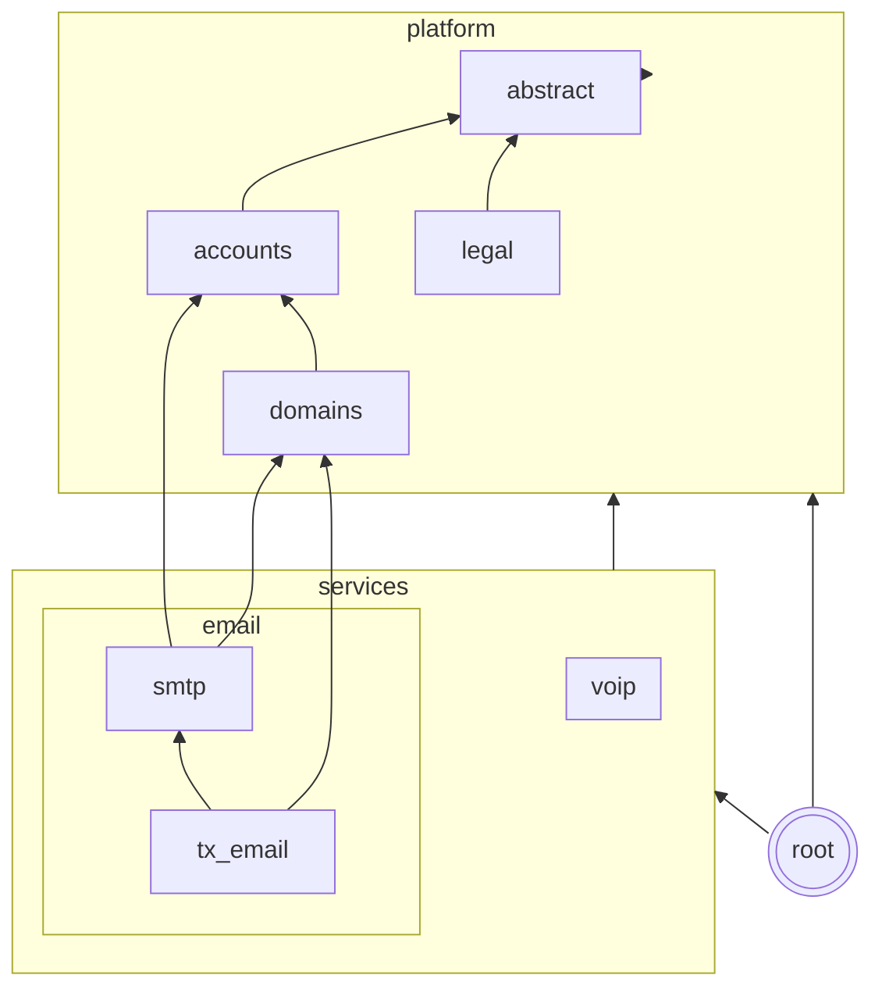

# Relay — B2B SaaS Communication Platform

A modern B2B SaaS communication platform built on Django 6.0 and Python 3.14, designed for AI applications,
with a **built-in authoritative nameserver** that eliminates manual DNS configuration.

## How It Works

Users only need to set **two DNS records**:

1. **NS delegation** — Delegate the sender subdomain to our nameservers
1. **DMARC record** — On the root domain

Everything else — MX, SPF, DKIM, Return-Path — is **served automatically**
by the built-in nameserver. No more digging through DNS provider dashboards.

## Free Sender Domain

Every account gets a **free sender domain** it can send from without configuring
any DNS of its own. The domain is set via `RELAY_FREE_SENDER_DOMAIN` (defaults
to `open.{RELAY_PLATFORM_DOMAIN}`, e.g. `open.localhost` in development) and is
backed by a system-owned `Domain` (`org=None`) that is auto-created by a
migration and DKIM-signed automatically.

The free domain is restricted: messages may only be sent to the user's own
registered email address. Use it to verify deliverability and test integrations
before delegating a real sender domain.

### DNS served automatically

The built-in nameserver serves the following records at the free domain apex.
No user action is required.

| Record | Location                                             | Value                                            |
| ------ | ---------------------------------------------------- | ------------------------------------------------ |
| A      | `open.{platform_domain}`                             | SMTP server IP(s)                                |
| MX     | `open.{platform_domain}`                             | `open.{platform_domain}` (priority 10)           |
| SPF    | `open.{platform_domain}` (TXT)                       | `v=spf1 a mx include:spf.{platform_domain} ~all` |
| DKIM   | `{selector}._domainkey.open.{platform_domain}` (TXT) | DKIM public key                                  |
| DMARC  | `_dmarc.open.{platform_domain}` (TXT)                | `v=DMARC1; p=none`                               |

### Operator setup

For the free domain to resolve in production, the platform operator must:

1. **Delegate the free domain zone to Relay's nameservers.** If
   `RELAY_FREE_SENDER_DOMAIN` is `open.example.com`, add NS records for the
   `open` subdomain pointing to the nameservers in
   `RELAY_DNS_NS_NAMESERVERS` (e.g. `ns1.example.com`, `ns2.example.com`). If
   the platform domain's NS records already point at Relay's nameservers, the
   free domain is served automatically as a subdomain and no extra delegation
   is needed.
1. **Make the SPF include resolve.** The free domain's SPF record includes
   `spf.{platform_domain}`. Ensure that TXT record exists and lists the SMTP
   server IPs.
1. **Set `RELAY_FREE_SENDER_DOMAIN`** to a domain delegated to Relay's
   nameservers.

## Architecture

```
Organization → Domain, SmtpCredential
```

- **Organization** — Owns resources (domains, SMTP credentials); each user gets a personal org on signup
- **Domain** — Sender domain with automatic DKIM key generation and DNS serving
- **SmtpCredential** — Per-org API key used to authenticate outgoing SMTP submissions

### Services

| Service | Port         | Description                          |
| ------- | ------------ | ------------------------------------ |
| Web     | 8000         | Django web UI (Granian)              |
| DNS     | 53 (UDP+TCP) | Authoritative nameserver (dnslib)    |
| SMTP    | 25, 587      | Outgoing SMTP submissions (aiosmtpd) |

### Tech Stack

- **Django 6.0** with the task framework for async message delivery
- **PostgreSQL** — primary database
- **Redis** — caching and rate limiting
- **S3** — raw message body storage via django-storages
- **Primer CSS** — GitHub's design system CSS framework for the web UI
- **Granian** — Rust-based ASGI server

## App dependencies

The graph shows a simplified representation of the app's dependencies.
App dependencies should only exist in a single direction.
Apps may access their parents or grandparents, but not their children.

We have different types of apps:

- **abstract**: Abstract apps are not meant to be used directly, but to be extended by other apps.
- **platform**: Shared infrastructure used across all communication services (email now, VoIP and more later).
- **services**: Specific communication services. Email today, VoIP and more tomorrow.


