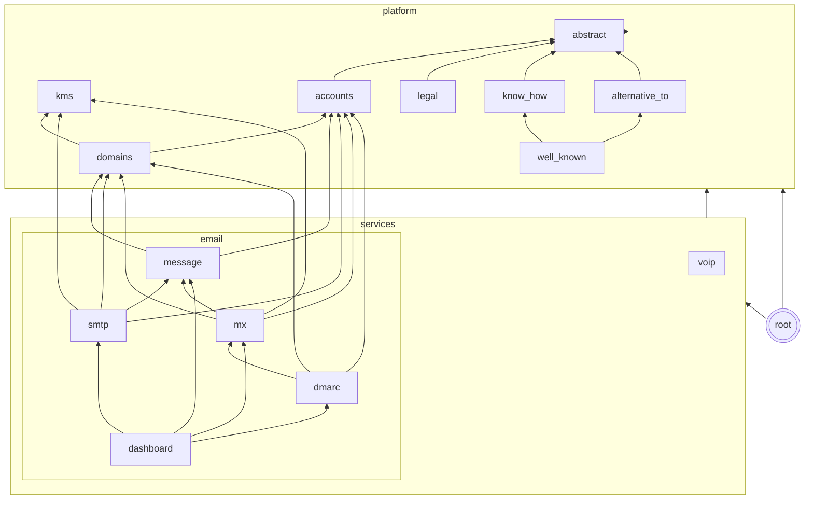

# Relay — B2B SaaS Communication Platform

A B2B SaaS communication platform for AI applications.
The platform has a **built-in authoritative nameserver**
that removes manual DNS configuration.

## How It Works

Users only need to set **two DNS records**:

1. **NS delegation** — Delegate the sender subdomain to our nameservers
1. **DMARC record** — On the root domain

Everything else — MX, SPF, DKIM, Return-Path — is **served automatically**
by the built-in nameserver. You do not need to use the DNS provider dashboard.

## Managed Sender Domain

Every organization gets a **managed sender domain** — a subdomain of the
platform's managed sender domain that Relay manages automatically. The domain is
set via `RELAY_MANAGED_SENDER_DOMAIN` (defaults to
`open.{RELAY_PLATFORM_DOMAIN}`, for example `open.localhost` in development).
When an organization is created, a `Domain` is auto-created with the name
`{org.slug}.{RELAY_MANAGED_SENDER_DOMAIN}` (for example `acme.open.localhost`).
The domain is DKIM-signed and pre-verified — no user DNS configuration needed.

The managed domain cannot be deleted from the dashboard. Users can still add
their own delegated domains alongside it.

### Operator setup

The platform operator only needs to delegate NS for the managed sender
domain zone to Relay's nameservers. If `RELAY_MANAGED_SENDER_DOMAIN` is
`open.example.com`, add NS records for the `open` subdomain pointing to
`RELAY_DNS_NS_NAMESERVERS` (for example, `ns1.example.com`, `ns2.example.com`).
All other records (MX, SPF, DKIM, DMARC, TLS-RPT) are served automatically
by the internal nameserver — no per-domain delegation needed.

## Architecture

```
Organization → Domain, SmtpCredential
```

- **Organization** — Owns resources (domains, credentials). Each user gets a personal org on signup.
- **Domain** — Root domain verified once with NS delegation + DMARC. Holds shared DKIM keys.
- **SendingDomain** — Envelope-from domain (for example, acme.com or app.acme.com) with SPF + DKIM CNAME. Shares the root domain's NS delegation.
- **ReceivingDomain** — Receiving domain with MX record pointing to the root domain's sender subdomain
- **SmtpCredential** — Per-org API key used to authenticate outgoing SMTP submissions
- **Webhook** — Per-org HTTPS endpoint with Ed25519 keypair for signing incoming-mail deliveries
- **DmarcReport** — Aggregate DMARC report (RUA) received from external organizations, parsed from XML
- **DmarcFailureReport** — Forensic DMARC report (RUF) received from external organizations, parsed from ARF
- **TlsReport** — TLS-RPT report received from external organizations, parsed from JSON via DRF serializers

All report models use multi-table inheritance with `IncomingMessage` so they
inherit the UUIDv7 primary key and inbound email metadata.

### Services

| Service | Port         | Description                          |
| ------- | ------------ | ------------------------------------ |
| Web     | 8000         | Django web UI (Granian)              |
| DNS     | 53 (UDP+TCP) | Authoritative nameserver (dnslib)    |
| SMTP    | 587          | Outgoing SMTP submissions (aiosmtpd) |
| MX      | 25           | Incoming MX delivery (aiosmtpd)      |
| Worker  | —            | Threadmill task worker               |

The MX server receives incoming email (port 25, STARTTLS by default) and
dispatches it to configurable per-organization webhooks. Clients configure
receiving domains (for example, `app.acme.com`) by pointing an MX record to their
sender subdomain (for example, `MX app.acme.com → mail.relay.acme.com`). Webhooks
follow the [Standard Webhooks](https://standardwebhooks.com) specification —
each delivery includes `webhook-id`, `webhook-timestamp`, and
`webhook-signature` headers with an Ed25519 (`v1a`) signature. Each webhook
has its own keypair, so clients verify with the webhook's public key
(`whpk_` format) using any Standard Webhooks SDK. The payload is flat event
data with a storage URL for the raw message body. The payload never includes
the raw body inline. You can filter webhooks by receiving domain and recipient
address glob pattern.

> **STARTTLS cert provisioning**: in production, mount the same certificate
> the Caddy reverse proxy uses into the MX container. Then point
> `RELAY_MX_TLS_CERT_PATH` and `RELAY_MX_TLS_KEY_PATH` at the certificate. The cert must
> include the MX hostname (for example, `mail.relay.acme.com`).

### Tech Stack

- **Django** with the task framework for async message delivery
- **PostgreSQL** — primary database
- **Redis** — caching and rate limiting
- **S3** — raw message body storage via django-storages
- **basecoat CSS** — component-based CSS framework for the web UI
- **Granian** — Rust-based ASGI server

### Error monitoring (Sentry)

All five processes report to a single Sentry project. Off by default; set
`SENTRY_DSN` to enable. PII (email bodies, tokens, credentials) is never
sent automatically.

| Variable                    | Default         | Description                                |
| --------------------------- | --------------- | ------------------------------------------ |
| `SENTRY_DSN`                | _(empty — off)_ | Project DSN. Required to enable reporting. |
| `SENTRY_ENVIRONMENT`        | `production`    | Sentry environment tag.                    |
| `SENTRY_TRACES_SAMPLE_RATE` | `0.0`           | Tracing sample rate (0–1). Off by default. |

## App dependencies

The graph shows a simplified representation of the app's dependencies.
App dependencies must exist only in a single direction.
Apps can access their parents or grandparents, but not their children.

We have different types of apps:

- **abstract**: Abstract apps are not used directly. Other apps extend them.
- **platform**: Shared infrastructure used across all communication services (email now, VoIP and more later).
- **services**: Specific communication services. Email today, with VoIP and more planned.


