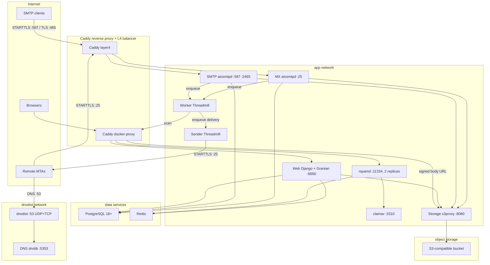
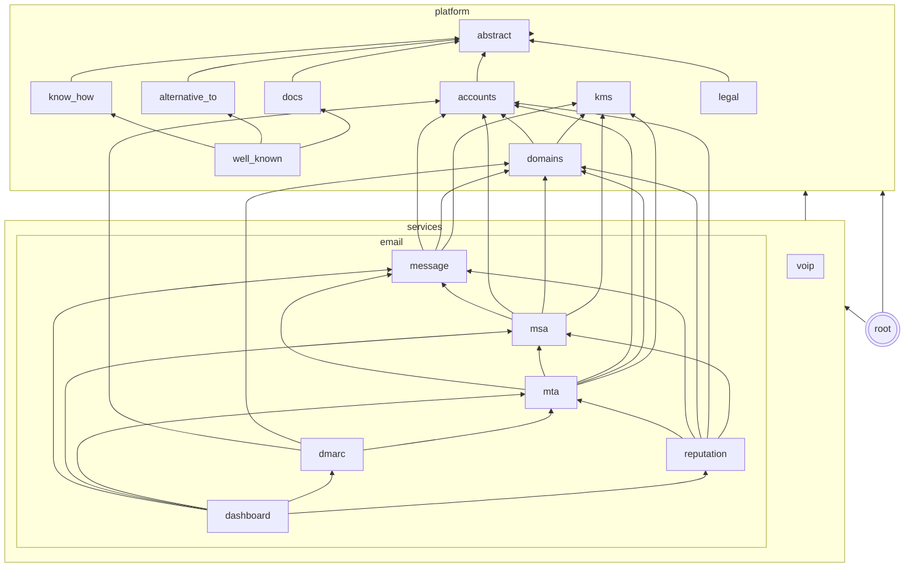

[](https://relays.to)

# relay: Developer-First IT Infrastructure

A developer-first IT infrastructure provider. We build superior products and
enable our clients to build AAA applications on top of them.

## Managed Sender Domain

Every organization gets a **managed sender domain**. It is a subdomain of the
platform domain, and relay manages it automatically. The domain is
derived from the platform domain as `open.{RELAY_PLATFORM_DOMAIN}` (for
example `open.localhost` in development).
When an organization is created, a `Domain` is auto-created with the name
`{org.slug}.{RELAY_MANAGED_SENDER_DOMAIN}` (for example `acme.open.localhost`).
The domain is DKIM-signed and pre-verified. No user DNS configuration needed.

The managed domain cannot be deleted from the dashboard. Users can still add
their own delegated domains alongside it.

### Operator setup

The platform operator must set up the following records on the
`RELAY_PLATFORM_DOMAIN` nameserver:

1. **NS delegation for `open.{platform_domain}`**. Add NS records for the
   `open` subdomain pointing to `RELAY_DNS_NS_NAMESERVERS` (for example,
   `ns1.{platform_domain}`, `ns2.{platform_domain}`).
1. **A/AAAA record for the web server**. The platform domain itself needs
   an A/AAAA record for the web UI.
1. **A/AAAA record for the storage host**. Caddy serves signed message body
   URLs on `storage.{platform_domain}`, and the certificate for that name
   needs a record that resolves. Point it at the web server, or set
   `RELAY_STORAGE_DOMAIN` to serve bodies from a different name.
1. **Forward DNS for the SMTP server**. Set `RELAY_DNS_SMTP_IPS`. The
   public hostname (`smtp.{platform_domain}`) and sender subdomains resolve
   to the SMTP server IPs, and the SPF record of each sender subdomain
   authorizes every one of them.
1. **Reverse DNS for every SMTP server IP**. Configure each IP owner's PTR
   record with the hosting provider. Outbound SMTP must use the corresponding
   hostname for EHLO.
1. **SPF include**. The `spf.{platform_domain}` TXT record must list the
   SMTP server IP addresses.
1. **DMARC**. `_dmarc.{platform_domain}` TXT record.
1. **MTA-STS**. `_mta-sts.{platform_domain}` TXT record and
   `mta-sts.{platform_domain}` CNAME.
1. **TLS-RPT**. `_smtp._tls.{platform_domain}` TXT record.

All per-org records (MX, SPF, DKIM, DMARC, TLS-RPT, MTA-STS) for managed
domains are served automatically by the internal nameserver. No
per-domain delegation is necessary.

Outgoing mail is dual-signed with DKIM: once for the sender's own domain
and once for the platform domain. The platform domain is the `Domain`
row whose name equals `RELAY_PLATFORM_DOMAIN`; until you register it,
relay signs with the sending domain only. Each signature covers a per-message
`Feedback-ID` header so FBL complaints attribute to the sending
organization.

## Architecture

```
Organization → Domain, SmtpCredential
```

- **Organization**: Owns resources (domains, credentials). Each user gets a personal org on signup.
- **Domain**: Root domain verified once with NS delegation + DMARC. Holds shared DKIM keys.
- **SendingDomain**: Envelope-from domain (for example, acme.com or app.acme.com) with SPF + DKIM CNAME. Shares the root domain's NS delegation.
- **ReceivingDomain**: Receiving domain with MX record pointing to the relay MX hostnames
- **SmtpCredential**: Per-org API key used to authenticate outgoing SMTP submissions
- **Webhook**: Per-org HTTPS endpoint with Ed25519 keypair for signing incoming-mail deliveries
- **DmarcReport**: Aggregate DMARC report (RUA) received from external organizations, parsed from XML
- **DmarcFailureReport**: Forensic DMARC report (RUF) received from external organizations, parsed from ARF
- **FblReport**: Feedback Loop complaint report, received from email providers as ARF (RFC 5965) or generated by relay for spam-flagged messages
- **TlsReport**: TLS-RPT report received from external organizations, parsed from JSON

All report models use multi-table inheritance with `IncomingMessage` so they
inherit the UUIDv7 primary key and inbound email metadata.

### Services

| Service | Port         | Description                                                    |
| ------- | ------------ | -------------------------------------------------------------- |
| Web     | 8000         | Django web UI (Granian)                                        |
| dnsdist | 53 (UDP+TCP) | DNS proxy with caching (production)                            |
| DNS     | 5353         | Authoritative nameserver (dnslib, internal only)               |
| SMTP    | 587, 465     | Outgoing SMTP submissions (aiosmtpd, behind Caddy L4)          |
| MX      | 25           | Incoming MX delivery (aiosmtpd, behind Caddy L4, STARTTLS)     |
| rspamd  | 11334        | Spam detection (internal only)                                 |
| clamav  | 3310         | Malware scanning (internal only)                               |
| Worker  | N/A          | Threadmill task worker for ingress, egress, and default queues |
| Sender  | N/A          | Threadmill task worker for delivery to remote MX hosts         |
| Storage | 8080         | Message body proxy with signed, expiring URLs                  |



The MX server receives incoming email (port 25, STARTTLS by default) and
dispatches it to configurable per-organization webhooks. Clients configure
receiving domains (for example, `app.acme.com`) by pointing an MX record to the
relay MX hostnames (for example, `MX app.acme.com → mx1.relays.to`). Webhooks
follow the [Standard Webhooks](https://standardwebhooks.com) specification -
each delivery includes `webhook-id`, `webhook-timestamp`, and
`webhook-signature` headers with an Ed25519 (`v1a`) signature. Each webhook
has its own keypair, so clients verify with the webhook's public key
(`whpk_` format) using any Standard Webhooks SDK. The payload is flat event
data with a signed storage URL for the raw message body, which expires after
an hour. The payload never includes the raw body inline. You can filter
webhooks by receiving domain and recipient address glob pattern.

### Task queues

Async work is split across four queues, so each pipeline stage can run on its
own worker and scale on its own:

- `ingress`: tasks that process received mail, so the inbound spam scan,
  webhook delivery, and TLS-RPT parsing.
- `egress`: tasks that process outgoing submissions, so the outbound spam
  scan and the postmaster forward.
- `delivery`: SMTP delivery to remote MX hosts. The sender worker is the only
  consumer, so it can be given dedicated outbound addresses.
- `default`: everything else, so DMARC and reputation reporting.

`TASKS["default"]["QUEUES"]` in `root/settings.py` holds the queue list. A task
whose queue is missing there fails at import time.

A worker serves its queues in the order given on the command line: threadmill
takes from the first non-empty queue, so a full queue always wins over the
queues after it. Keep the mail pipeline queues ahead of `default`, which
carries report parsing that can back up without delaying mail.

### Spam and virus scanning

The egress and ingress workers scan every stored message with rspamd before
delivery or webhook dispatch, and record the score, the action, and the
antivirus verdict on the message.

| Variable                    | Default               | Description                                                     |
| --------------------------- | --------------------- | --------------------------------------------------------------- |
| `RELAY_RSPAMD_URL`          | `http://rspamd:11334` | Controller address, the password may ride along as URL userinfo |
| `RELAY_RSPAMD_PASSWORD`     | _(from the URL)_      | Controller password                                             |
| `RELAY_RSPAMD_HOLD_SCORE`   | `6.0`                 | Outbound score at which a message is held                       |
| `RELAY_RSPAMD_REJECT_SCORE` | `15.0`                | Inbound score at which a message is quarantined                 |

ClamAV reports one symbol per outcome, and the client maps them: `CLAM_VIRUS`
with the virus name for a detection, `CLAM_VIRUS_ENCRYPTED` and
`CLAM_VIRUS_MACRO` for content the scanner cannot read, `CLAM_VIRUS_LIMITS`
for a part that exceeded the scanner's working limits, and `CLAM_VIRUS_FAIL`
when clamd did not answer, which retries the scan instead of storing a
verdict.

A clean scan carries no symbol at all, so rspamd never confirms that
ClamAV ran. The `clamav` block of `compose.production.yml` sets
`log_clean`, which logs every part ClamAV reports clean, and the controller
statistics behind `RELAY_RSPAMD_PASSWORD` count the messages rspamd
scanned. To exercise the whole path, send an EICAR test attachment through
submission or the MX: it must land held (outbound) or quarantined (inbound)
with `CLAM_VIRUS` in the stored symbols.

The client asks for a profiled reply, so the check record also keeps the
duration rspamd measured for the task and, for the messages rspamd chooses
to profile, the per-symbol breakdown and the share the antivirus took.
rspamd profiles a sample rather than every task: the first task per worker
process per minute, about a percent of the rest, anything of 2 MiB or more,
and rules that have already run slow. The antivirus timing is therefore
present on a minority of checks, and the message timeline shades the share
of the check it took whenever it is.

### Feedback loop (FBL) reports

FBL complaints arrive at `RELAY_FBL_ADDRESS` and count only for senders
listed in `RELAY_FBL_SENDERS`. Register the address with each provider and
allowlist their report sender.

| Variable            | Default                          | Description                                                                    |
| ------------------- | -------------------------------- | ------------------------------------------------------------------------------ |
| `RELAY_FBL_ADDRESS` | `fbl@` + `RELAY_PLATFORM_DOMAIN` | The FBL ingestion mailbox. Register it with your providers.                    |
| `RELAY_FBL_SENDERS` | _(empty: off)_                   | Exact provider envelope addresses, one per provider. Empty disables ingestion. |

### Free tier and billing

Every organization sends `RELAY_FREE_MONTHLY_MESSAGES` messages a month
for free, and the reputation overview prices every 1,000 messages beyond
that allowance at `RELAY_PRICE_PER_1000_MESSAGES`, rounded to cents. The
default price of zero leaves every organization on the free tier.
`RELAY_CURRENCY` labels each amount, a code (`USD `) or a symbol
(`EUR `). django-environ reads a leading `$` as a reference to another
variable, so a literal dollar sign needs `env.escape_proxy = True` and the
escaped form `\$`; the default is therefore a code.

| Variable                        | Default | Description                                                        |
| ------------------------------- | ------- | ------------------------------------------------------------------ |
| `RELAY_FREE_MONTHLY_MESSAGES`   | `1000`  | Messages per organization per month inside the free tier.          |
| `RELAY_PRICE_PER_1000_MESSAGES` | `0.0`   | Price of 1,000 messages beyond the allowance, in `RELAY_CURRENCY`. |
| `RELAY_CURRENCY`                | `USD `  | Label in front of every amount, a code or a symbol.                |

### Tech Stack

- **Django** with the task framework for async message delivery
- **PostgreSQL**. Primary database
- **Redis**. Caching and rate limiting
- **S3**. Raw message body storage via django-storages, published through
  the storage proxy with signed, expiring URLs
- **basecoat CSS**. Component-based CSS framework for the web UI
- **Granian**: Rust-based ASGI server

### Error monitoring (Sentry)

All five processes report to a single Sentry project. Off by default; set
`SENTRY_DSN` to enable. PII (email bodies, tokens, credentials) is never
sent automatically.

| Variable                    | Default        | Description                                |
| --------------------------- | -------------- | ------------------------------------------ |
| `SENTRY_DSN`                | _(empty: off)_ | Project DSN. Required to enable reporting. |
| `SENTRY_ENVIRONMENT`        | `production`   | Sentry environment tag.                    |
| `SENTRY_TRACES_SAMPLE_RATE` | `0.0`          | Tracing sample rate (0-1). Off by default. |

## App dependencies

The graph shows a simplified representation of the app's dependencies.
App dependencies must exist only in a single direction.
Apps can access their parents or grandparents, but not their children.

We have different types of apps:

- **abstract**: Abstract apps are not used directly. Other apps extend them.
- **platform**: Shared infrastructure used across all communication services (email now, VoIP and more later).
- **services**: Specific communication services. Email today, with VoIP and more planned.


