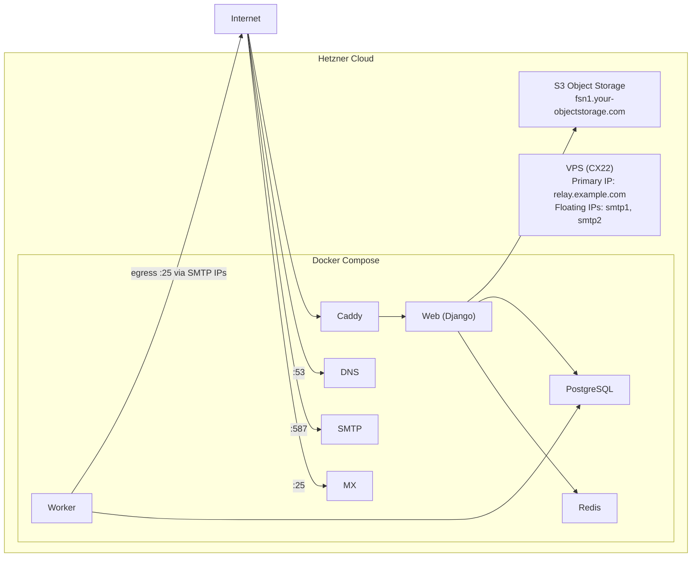

# Deploy relay on Hetzner with the hcloud CLI

Provision a Hetzner Cloud server with a pool of SMTP egress IPs for email
deliverability, Hetzner Object Storage for file storage, and deploy relay via
[the-box](https://github.com/codingjoe/the-box) (Docker Compose) with GitHub
Actions CI/CD.

Everything in this directory is driven by two shell scripts and the `hcloud`
CLI. There is no Terraform state to keep.

## Architecture



Outgoing mail is delivered by the worker only, which egresses from the SMTP IP
pool above. The web and SMTP-in containers never egress from pool IPs.

Each floating IP has its own PTR record, `smtp<n>.<hostname>`. If one gets
blacklisted, rotate to the next IP in both `RELAY_DNS_SMTP_IPS` and
`RELAY_SMTP_SOURCE_IPS`.

## Prerequisites

- **hcloud CLI** (`brew install hcloud`)
- **AWS CLI** (`brew install awscli`), for Hetzner Object Storage
- **jq**, **envsubst** (`brew install jq gettext`), **ssh-keygen**
- **GitHub CLI** (`gh`) installed and authenticated
- **dotenvx** (`npm install -g @dotenvx/dotenvx`)
- **A Hetzner Cloud API token** (Console → Security → API Tokens)
- **Hetzner S3 credentials** (Console → Object Storage → Credentials)
- **Your SSH public key** (for root access)
- **A DNS domain** with A record access

## Step 1: Configure hcloud

```bash
HCLOUD_TOKEN="<your-hetzner-api-token>" hcloud context create relay --token-from-env
hcloud server list
```

## Step 2: Provision

Export the Object Storage credentials and run the script. It creates the
deploy SSH key pair, uploads the SSH keys, creates the SMTP floating IPs,
creates the server with cloud-init, assigns the floating IPs, sets all PTR
records, creates the S3 bucket, and writes the GitHub variables and secrets.

```bash
export AWS_ACCESS_KEY_ID="<your-s3-access-key>"
export AWS_SECRET_ACCESS_KEY="<your-s3-secret-key>"

RELAY_HOSTNAME="relay.example.com" \
    SSH_PUBLIC_KEY_FILES="$HOME/.ssh/id_ed25519.pub" \
    ./deploy/provision.sh
```

The script is idempotent. Re-running it leaves existing resources and existing
`POSTGRES_PASSWORD`, `REDIS_PASSWORD`, and `SECRET_KEY` values untouched.

It provisions:

- Hetzner Cloud server (CX22, Ubuntu 24.04) with Docker
- A pool of floating IPs for SMTP with PTR records, bound to `eth0` by
  cloud-init at first boot
- S3 bucket on Hetzner Object Storage
- Deployment SSH key pair at `deploy/id_ed25519`

### Configuration

Every value below is an environment variable with a default.

| Variable                 | Default                                | Purpose                      |
| ------------------------ | -------------------------------------- | ---------------------------- |
| `RELAY_HOSTNAME`         | `relay.example.com`                    | Public hostname              |
| `SERVER_TYPE`            | `cx22`                                 | hcloud server type           |
| `SERVER_IMAGE`           | `ubuntu-24.04`                         | hcloud image                 |
| `SERVER_LOCATION`        | `fsn1`                                 | hcloud location              |
| `SMTP_FLOATING_IP_COUNT` | `2`                                    | Size of the SMTP egress pool |
| `S3_ENDPOINT`            | `fsn1.your-objectstorage.com`          | Object Storage endpoint      |
| `S3_REGION`              | `fsn1`                                 | Object Storage region        |
| `S3_BUCKET`              | `relay-<hostname with dots as dashes>` | Bucket name                  |
| `SSH_PUBLIC_KEY_FILES`   | `~/.ssh/id_ed25519.pub`                | Space separated public keys  |
| `DEPLOY_KEY`             | `deploy/id_ed25519`                    | Deploy key pair location     |

Bucket names must be unique across all of Hetzner Object Storage. Override
`S3_BUCKET` if the derived name is taken.

## Step 3: Configure DNS

```
A  relay.example.com        <server_ip>
A  smtp1.relay.example.com  <smtp_ip_1>
A  smtp2.relay.example.com  <smtp_ip_2>
A  mx.example.com           <server_ip>
A  dns.example.com          <server_ip>
A  *.relay.example.com      <server_ip>
```

A record hostnames for the SMTP IP pool must match their PTR records. PTR
records are set by the script automatically.

## Step 4: Add the OAuth credentials

The script writes the infrastructure values to `.env.production`. GitHub OAuth
credentials are user-specific and stay manual:

```bash
dotenvx set GITHUB_CLIENT_ID "<oauth-client-id>" -f .env.production
dotenvx set GITHUB_CLIENT_SECRET "<oauth-client-secret>" -f .env.production

git add .env.production
git commit -m "Add OAuth credentials"
git push
```

If `deploy/provision.sh` reported that `.env.keys` is missing, it printed the
full list of `dotenvx` commands to run instead. Run them first.

## Step 5: Deploy

```bash
gh workflow run deploy.yml
```

CI builds and pushes the image to ghcr.io, then the-box deploys via SSH.

## Step 6: Verify

```bash
curl https://relay.example.com/health/
openssl s_client -connect smtp1.relay.example.com:587 -starttls smtp
dig MX example.com @dns.example.com
```

## IP reputation and blacklist rotation

`RELAY_DNS_SMTP_IPS` and `RELAY_SMTP_SOURCE_IPS` contain the same IPs: the
floating IP pool plus the server primary IP, so every IP is published and used
for sending.

- `RELAY_DNS_SMTP_IPS` is read by web and published in SPF and Return-Path
  records.
- `RELAY_SMTP_SOURCE_IPS` is read by the worker, which runs on the host network
  and picks one at random for each send. An empty list sends from the primary
  IP.

Set `SMTP_FLOATING_IP_COUNT` high enough to keep a spare IP for rotation.

If an SMTP IP gets blacklisted:

1. Update env: `dotenvx set RELAY_DNS_SMTP_IPS "<remaining IPs>,<server_ip>" -f .env.production -p`
1. Update env: `dotenvx set RELAY_SMTP_SOURCE_IPS "<remaining IPs>,<server_ip>" -f .env.production -p`
1. Push: `git add .env.production && git commit -m "Switch SMTP IP" && git push`
   Web then publishes the updated IPs in SPF and Return-Path records.
1. Monitor at [MXToolbox](https://mxtoolbox.com/blacklists.aspx)
1. Keep the blacklisted IP assigned but unused until delisted

## Day-2 operations

```bash
hcloud server ssh relay.example.com          # log in over SSH
hcloud server metrics relay.example.com      # CPU, disk, network
hcloud server create-image --type snapshot --name relay-$(date +%F) relay.example.com
hcloud server enable-backup relay.example.com
hcloud floating-ip list -l relay=smtp -o columns=name,ip
hcloud all list --paid                        # everything that costs money
```

Changing `SMTP_FLOATING_IP_COUNT` adds floating IPs. Re-running the script does
**not** re-render cloud-init on an existing server. `user_data` is only applied
at first boot. To bind a newly added floating IP to `eth0`, add it manually or
recreate the server:

```bash
hcloud server ssh relay.example.com "sudo ip addr add <new_ip>/32 dev eth0"
```

## Teardown

```bash
RELAY_HOSTNAME="relay.example.com" ./deploy/teardown.sh
```

The bucket holds stored mail and is kept unless you set `DELETE_BUCKET=1`. Set
`FORCE=1` to skip the confirmation prompt.

## Troubleshooting

- **Containers not starting**: `hcloud server ssh <hostname> docker compose ps`
- **Floating IPs missing**: `hcloud server ssh <hostname> ip addr show eth0`;
  cloud-init binds them at first boot and on network events via
  `networkd-dispatcher`
- **SMTP refused**: `hcloud server ssh <hostname> docker compose logs msa`
- **Outgoing delivery failing**: `hcloud server ssh <hostname> docker compose logs worker`
- **TLS not issuing**: `dig <hostname>` then `hcloud server ssh <hostname> docker compose logs caddy`
- **S3 access denied**: Verify credentials in `.env.production` match Hetzner
  Console
- **`put-bucket-ownership-controls` fails**: not every Object Storage
  deployment accepts ownership controls. The bucket still works without them.
