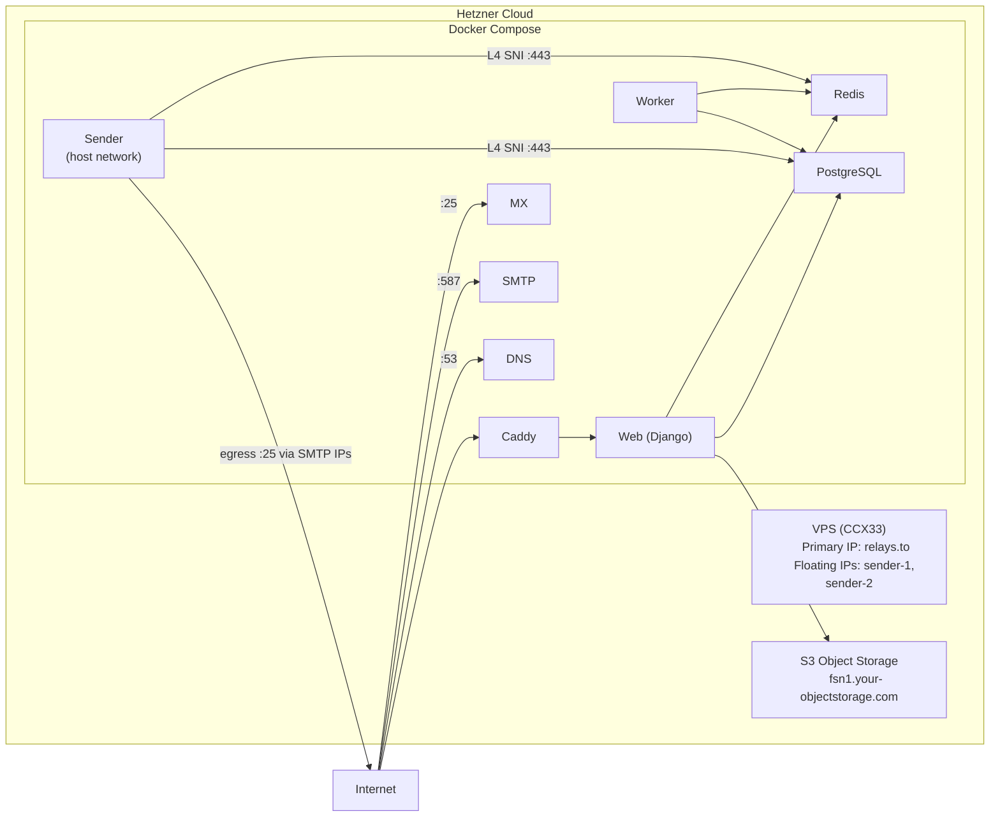

# Deploy relay on Hetzner with the hcloud CLI

Provision a Hetzner Cloud server with a pool of SMTP egress IPs for email
deliverability, Hetzner Object Storage for file storage, and deploy relay via
[the-box](https://github.com/codingjoe/the-box) (Docker Compose) with GitHub
Actions CI/CD.

`provision.sh` runs the steps in `steps/`, one script per step, in the order a
deployment needs them. Every step checks the resource it manages before it
changes anything, so a rerun skips what is done and picks up where the last run
stopped.

## Architecture



The sender runs on the host network so it can bind each pool address for
outbound delivery. Everything else stays on the Compose bridge.

Each floating IP publishes its own PTR record,
`sender-<n>.mail.<hostname>`. To rotate away from a blacklisted address,
replace it in both `RELAY_DNS_SMTP_IPS` and `RELAY_SMTP_SOURCE_IPS`.

## Prerequisites

- **hcloud CLI** (`brew install hcloud`)
- **AWS CLI** (`brew install awscli`), for Hetzner Object Storage
- **jq**, **envsubst** (`brew install jq gettext`), **ssh-keygen**, **dig**
  (`brew install bind` or your distribution's `dnsutils`)
- **GitHub CLI** (`gh`) installed and authenticated
- **dotenvx** (`npm install -g @dotenvx/dotenvx`)
- **A Hetzner Cloud API token** (Console → Security → API Tokens)
- **Hetzner S3 credentials** (Console → Object Storage → Credentials)
- **Your SSH public key** (for root access)
- **A DNS domain** with A record access

> [!IMPORTANT]
> Open outbound ports 25 and 465 before you cut over. The egress pool carries
> your outbound mail, so delivery depends on them. Once you have paid your
> first invoice you can open them in the Console; before that, request it
> through the support form with your use case.

## The provisioning steps

| Step          | What it does                                                               | What it needs from you            |
| ------------- | -------------------------------------------------------------------------- | --------------------------------- |
| `zone`        | Creates the Hetzner Cloud DNS zone                                         |                                   |
| `delegation`  | Waits until your registrar delegates the domain to the Hetzner nameservers | the delegation, at your registrar |
| `keys`        | Creates the deployment SSH key pair and uploads your SSH keys              |                                   |
| `egress`      | Creates the pool of floating IPs                                           |                                   |
| `server`      | Creates the server and assigns the pool to it                              |                                   |
| `records`     | Publishes the A records and the PTR records                                |                                   |
| `propagation` | Waits until public resolvers answer with those records                     |                                   |
| `storage`     | Creates the Object Storage bucket                                          | S3 credentials                    |
| `environment` | Writes the GitHub variables, secrets and `.env.production`                 | `gh` and `dotenvx`                |

```bash
./deploy/provision.sh              # run every step that is not done yet
./deploy/provision.sh records      # run one step, by name
./deploy/provision.sh --status     # what is done, what is pending, and when
./deploy/provision.sh --list       # the steps, in order
```

The order is the dependency order. The zone is what every later step is
verified against, the delegation is the one thing only you can do, the egress
pool has to exist before the server boots with it, and the records need the
address the server only gets when it exists.

A step ends in one of three ways:

- It created or updated something.
- `nothing to do`: the resource is already there.
- It stopped and the run halts. The step prints what it needs, and running the
  same command again retries it.

### What the run remembers

The run writes what it created to `deploy/.state/`, which is git-ignored:

- `state.env` holds the values of the deployment: the server address, the
  egress addresses, the nameservers and the bucket.
- `steps/<name>` holds, per step, when it last ran and what it did.

Those files are a record, not a decision. Every step verifies the resource
itself, so deleting a record, a floating IP or the whole directory makes the
step run again rather than trust what was written.

### A custom domain for the bucket

Hetzner Object Storage has no support for a custom domain on a bucket. A CNAME
alone sends the wrong `Host` header, and rewriting it breaks the signature on
the URLs relay hands to browsers for message downloads. Serving stored mail
from a domain of your own needs a proxy in front of the bucket, such as
[s3-proxy](https://github.com/oxyno-zeta/s3-proxy), which is a change of its
own.

## Step 1: Configure hcloud

```bash
HCLOUD_TOKEN="<your-hetzner-api-token>" hcloud context create relay --token-from-env
hcloud server list
```

## Step 2: Provision

Export the Object Storage credentials and run the entry point. It walks the
steps in order and stops at the first one that needs you.

```bash
export AWS_ACCESS_KEY_ID="<your-s3-access-key>"
export AWS_SECRET_ACCESS_KEY="<your-s3-secret-key>"

RELAY_HOSTNAME="relays.to" \
    SSH_PUBLIC_KEY_FILES="$HOME/.ssh/id_ed25519.pub" \
    ./deploy/provision.sh
```

The first stop is normally the delegation. The step prints the nameservers to
hand your registrar and waits for them, so you can either set them while it
waits or stop the run and start it again later.

> [!TIP]
> A rerun resumes. Every step verifies the resource it manages before it
> changes anything, so a run that stopped keeps the work it did and never
> touches a credential that is already live.

> [!TIP]
> Only the `storage` and `environment` steps read the credentials above, so the
> DNS zone, the delegation and the server work before you have them.

It provisions:

- Hetzner Cloud server (CCX33) on Hetzner's `docker-ce` app image: Ubuntu 24.04
  with Docker CE and the Compose plugin
- A pool of floating IPs for SMTP, each with a PTR record, bound to `eth0` at
  first boot
- S3 bucket on Hetzner Object Storage
- Deployment SSH key pair at `deploy/id_ed25519`

> [!CAUTION]
> The bucket holds stored mail. Emptying it deletes that mail.

### Overrides

The steps supply defaults for everything else. These are the values worth
knowing before you run them:

- `SMTP_FLOATING_IP_COUNT` (default `2`) sets the egress pool size. Raise it to
  keep a spare address for rotation, then run `./deploy/provision.sh egress records` to create the address and publish its records.
- `SERVER_TYPE` (default `ccx33`) and `SERVER_LOCATION` (default `fsn1`) pick
  the box. Override them when your account or location does not offer that
  type. The server step checks the pairing against the hcloud API before it
  creates anything.
- `S3_BUCKET` (default `relay-<hostname with dots as dashes>`) names the
  bucket. Bucket names are unique across Hetzner Object Storage, so override it
  when the derived name is taken.
- `SERVER_IMAGE` (default `docker-ce`) selects Hetzner's app image, which is
  Ubuntu 24.04 with Docker CE and the Compose plugin, so cloud-init only
  creates the users and binds the floating IPs. Point it at a plain system
  image to install Docker yourself.
- `PUBLIC_RESOLVERS` (default `1.1.1.1 9.9.9.9`) are the resolvers the
  delegation and propagation steps wait for. Every one of them has to agree
  before a step passes.
- `WAIT_TIMEOUT_SECS` (default `600`) and `WAIT_INTERVAL_SECS` (default `15`)
  bound how long those steps wait before they stop and let you run them again.
- `RELAY_STATE_DIR` moves the directory the run records itself in.

## Step 3: Delegate DNS

The `zone` step creates the zone in Hetzner Cloud DNS, and the `delegation`
step hands you the nameservers it returns. The `records` step writes the
records below, then waits for public resolvers to answer with them. The
`sender-<n>.mail` records mirror the floating IPs, so raising
`SMTP_FLOATING_IP_COUNT` and running the `egress` and `records` steps adds
them. Excluding an address from sending changes only `RELAY_DNS_SMTP_IPS` and
`RELAY_SMTP_SOURCE_IPS`, which the containers read from `.env.production`.

```
A  relays.to                 <server_ip>
A  sender-1.mail.relays.to   <smtp_ip_1>
A  sender-2.mail.relays.to   <smtp_ip_2>
A  mx1.relays.to             <server_ip>
A  mx2.relays.to             <server_ip>
A  ns1.relays.to             <server_ip>
A  ns2.relays.to             <server_ip>
A  *.relays.to               <server_ip>
```

> [!IMPORTANT]
> Delegate `relays.to` to the nameservers the `delegation` step prints.
> Nothing in the zone resolves until your registrar points at them. The step
> passes once a public resolver answers with them. Confirm with
> `hcloud zone describe relays.to -o json | jq .authoritative_nameservers`,
> where `delegation_status` reads `valid` once it is right.

> [!IMPORTANT]
> Each `sender-<n>.mail` record has to match the PTR record on the same address.
> The `records` step sets the PTR records, and receivers confirm them by looking
> up the name forward, so these records are what make the pool verifiable. It
> checks both directions before it reports the work as done.

The `ns` and `mx` hostnames match `RELAY_DNS_NS_NAMESERVERS` and
`RELAY_DNS_MX_HOSTNAMES` in `root/settings.py`.

The sender reaches `pg.<HOSTNAME>` and `redis.<HOSTNAME>` over the-box's Layer
4 SNI routes on `:443`, where Caddy terminates TLS and proxies to the internal
ports. That is why its `DATABASE_URL` carries `sslmode=require` and its
`REDIS_URL` uses `rediss://`. The wildcard record covers both while `HOSTNAME`
is the zone apex; add those two records when it is not. Every other container
reaches PostgreSQL and Redis over the bridge by Docker DNS.

## Step 4: Add the OAuth credentials

The script writes the infrastructure values to `.env.production`. GitHub OAuth
credentials are user-specific and stay manual:

```bash
dotenvx set GITHUB_CLIENT_ID "<oauth-client-id>" -f .env.production
dotenvx set GITHUB_CLIENT_SECRET "<oauth-client-secret>" -f .env.production

git add .env.production
git commit -m "Add OAuth credentials"
git push
```

If the `environment` step printed a list of `dotenvx` commands instead, run
those first.

## Step 5: Deploy

```bash
gh workflow run deploy.yml
```

CI builds and pushes the image to ghcr.io, then the-box deploys via SSH.

## Step 6: Verify

```bash
curl https://relays.to/health/
openssl s_client -connect smtp.relays.to:587 -starttls smtp
dig MX relays.to @ns1.relays.to
dig +short pg.relays.to
dig +short redis.relays.to
```

The final two confirm the sender's path to PostgreSQL and Redis: Caddy's Layer
4 listener terminates TLS and proxies to the internal ports. Spam scanning runs
on the bridge, where the worker reaches rspamd over the internal `caddy:11334`
route.

## IP reputation and blacklist rotation

`RELAY_DNS_SMTP_IPS` and `RELAY_SMTP_SOURCE_IPS` carry the same addresses: the
floating IP pool plus the server primary IP, so every address is published and
used for sending.

- `RELAY_DNS_SMTP_IPS` is read by web and published in SPF and Return-Path
  records.
- `RELAY_SMTP_SOURCE_IPS` is read by the sender, which picks one at random for
  each send.

Set `SMTP_FLOATING_IP_COUNT` high enough to keep a spare address for rotation.

To rotate away from a blacklisted address:

1. Update env: `dotenvx set RELAY_DNS_SMTP_IPS "<remaining IPs>,<server_ip>" -f .env.production -p`
1. Update env: `dotenvx set RELAY_SMTP_SOURCE_IPS "<remaining IPs>,<server_ip>" -f .env.production -p`
1. Push: `git add .env.production && git commit -m "Switch SMTP IP" && git push`
   Web then publishes the updated IPs in SPF and Return-Path records.
1. Track the address at [MXToolbox](https://mxtoolbox.com/blacklists.aspx) and
   keep it assigned until it clears.

## Day-2 operations

```bash
hcloud server ssh relays.to          # log in over SSH
hcloud server metrics relays.to      # CPU, disk, network
hcloud server create-image --type snapshot --name relay-$(date +%F) relays.to
hcloud server enable-backup relays.to
hcloud floating-ip list -l relay=smtp -o columns=name,ip
hcloud all list --paid                        # everything that costs money
```

> [!IMPORTANT]
> `user_data` is applied at first boot. To grow the pool later, raise
> `SMTP_FLOATING_IP_COUNT`, run the `egress` and `server` steps to create and
> assign the addresses, then bind the new one on the server:

```bash
hcloud server ssh relays.to "sudo ip addr add <new_ip>/32 dev eth0"
```

## Diagnostics

Run these against a running box:

- `./deploy/provision.sh --status` shows which steps are done, which are
  pending, and when each last ran
- `hcloud server ssh <hostname> docker compose ps` shows container state
- `hcloud server ssh <hostname> ip addr show eth0` shows the bound pool
  addresses, which cloud-init adds at first boot and `networkd-dispatcher`
  re-adds on network events
- `hcloud server ssh <hostname> docker compose logs msa sender` shows
  submission and outbound delivery
- `hcloud server ssh <hostname> docker compose logs caddy` alongside
  `dig <hostname>` shows certificate issuance
- `dig +short pg.<hostname>` and `dig +short redis.<hostname>` show the
  sender's route to PostgreSQL and Redis
