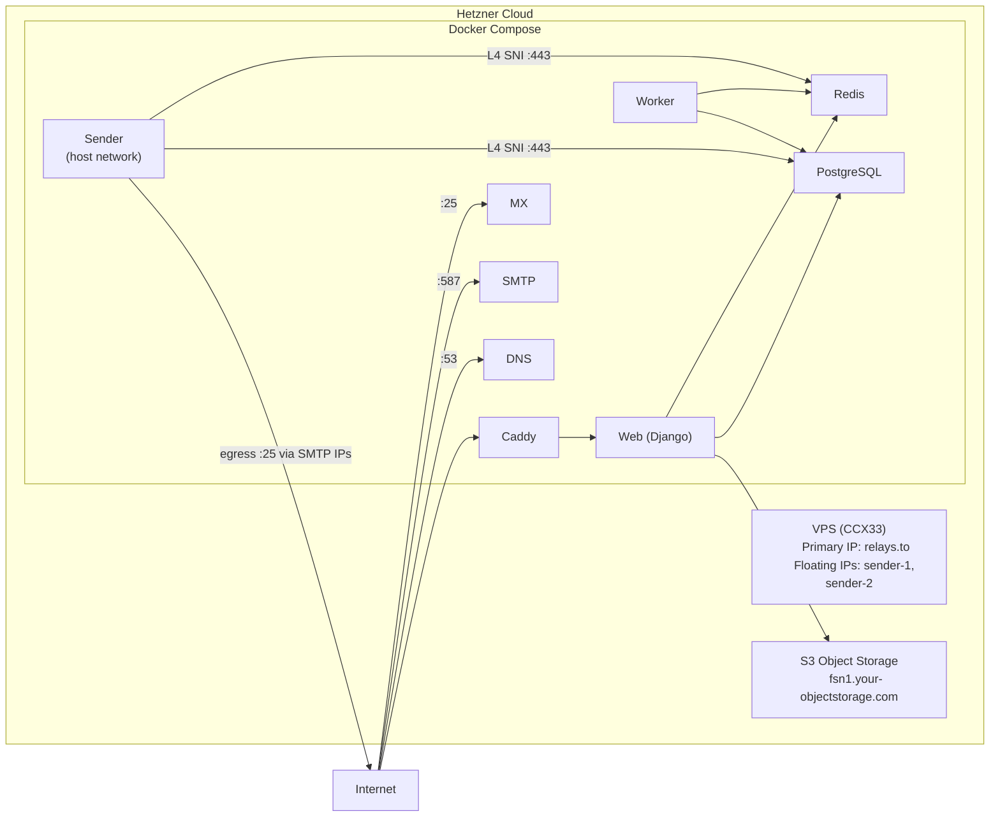

# Deploy relay on Hetzner with the hcloud CLI

Provision a Hetzner Cloud server with a pool of SMTP egress IPs for email
deliverability, Hetzner Object Storage for file storage, and deploy relay via
[the-box](https://github.com/codingjoe/the-box) (Docker Compose) with GitHub
Actions CI/CD.

Everything in this directory is driven by one shell script and the `hcloud`
CLI.

## Architecture



The sender runs on the host network so it can bind each pool address for
outbound delivery. Everything else stays on the Compose bridge.

Each floating IP publishes its own PTR record,
`sender-<n>.mail.<hostname>`. To rotate away from a blacklisted address,
replace it in both `RELAY_DNS_SMTP_IPS` and `RELAY_SMTP_SOURCE_IPS`.

## Prerequisites

- **hcloud CLI** (`brew install hcloud`)
- **AWS CLI** (`brew install awscli`), for Hetzner Object Storage
- **jq**, **envsubst** (`brew install jq gettext`), **ssh-keygen**
- **GitHub CLI** (`gh`) installed and authenticated
- **dotenvx** (`npm install -g @dotenvx/dotenvx`)
- **A Hetzner Cloud API token** (Console → Security → API Tokens)
- **Hetzner S3 credentials** (Console → Object Storage → Credentials)
- **Your SSH public key** (for root access)
- **A DNS domain** with A record access

> [!IMPORTANT]
> Open outbound ports 25 and 465 before you cut over. The egress pool carries
> your outbound mail, so delivery depends on them. Once you have paid your
> first invoice you can open them in the Console; before that, request it
> through the support form with your use case.

## Step 1: Configure hcloud

```bash
HCLOUD_TOKEN="<your-hetzner-api-token>" hcloud context create relay --token-from-env
hcloud server list
```

## Step 2: Provision

Export the Object Storage credentials and run the script. It creates the
deploy SSH key pair, uploads the SSH keys, creates the SMTP floating IPs,
creates the server with cloud-init, assigns the floating IPs, sets all PTR
records, creates the S3 bucket, and writes the GitHub variables and secrets.

```bash
export AWS_ACCESS_KEY_ID="<your-s3-access-key>"
export AWS_SECRET_ACCESS_KEY="<your-s3-secret-key>"

RELAY_HOSTNAME="relays.to" \
    SSH_PUBLIC_KEY_FILES="$HOME/.ssh/id_ed25519.pub" \
    ./deploy/provision.sh
```

> [!TIP]
> The script is idempotent. Re-running it keeps the existing resources and the
> existing `POSTGRES_PASSWORD`, `REDIS_PASSWORD` and `SECRET_KEY` values.

It provisions:

- Hetzner Cloud server (CCX33) on Hetzner's `docker-ce` app image: Ubuntu 24.04
  with Docker CE and the Compose plugin
- A pool of floating IPs for SMTP, each with a PTR record, bound to `eth0` at
  first boot
- S3 bucket on Hetzner Object Storage
- Deployment SSH key pair at `deploy/id_ed25519`

> [!CAUTION]
> The bucket holds stored mail. Emptying it deletes that mail.

### Overrides

`provision.sh` supplies defaults for everything else. These are the values
worth knowing before you run it:

- `SMTP_FLOATING_IP_COUNT` (default `2`) sets the egress pool size. Raise it to
  keep a spare address for rotation.
- `SERVER_TYPE` (default `ccx33`) and `SERVER_LOCATION` (default `fsn1`) pick
  the box. Override them when your account or location does not offer that
  type. The script checks the pairing against the hcloud API before it creates
  anything.
- `S3_BUCKET` (default `relay-<hostname with dots as dashes>`) names the
  bucket. Bucket names are unique across Hetzner Object Storage, so override it
  when the derived name is taken.
- `SERVER_IMAGE` (default `docker-ce`) selects Hetzner's app image, which is
  Ubuntu 24.04 with Docker CE and the Compose plugin, so cloud-init only
  creates the users and binds the floating IPs. Point it at a plain system
  image to install Docker yourself.

## Step 3: Delegate DNS

`provision.sh` creates the zone in Hetzner Cloud DNS and writes these records,
then prints the nameservers to hand your registrar. The `sender-<n>.mail`
records mirror the floating IPs, so raising `SMTP_FLOATING_IP_COUNT` and
re-running the script adds them. Excluding an address from sending changes only
`RELAY_DNS_SMTP_IPS` and `RELAY_SMTP_SOURCE_IPS`, which the containers read from
`.env.production`.

```
A  relays.to                 <server_ip>
A  sender-1.mail.relays.to   <smtp_ip_1>
A  sender-2.mail.relays.to   <smtp_ip_2>
A  mx1.relays.to             <server_ip>
A  mx2.relays.to             <server_ip>
A  ns1.relays.to             <server_ip>
A  ns2.relays.to             <server_ip>
A  *.relays.to               <server_ip>
```

> [!IMPORTANT]
> Delegate `relays.to` to the nameservers `provision.sh` prints. Nothing in the
> zone resolves until your registrar points at them. Confirm with
> `hcloud zone describe relays.to -o json | jq .authoritative_nameservers`,
> where `delegation_status` reads `valid` once it is right.

> [!IMPORTANT]
> Each `sender-<n>.mail` record has to match the PTR record on the same address.
> `provision.sh` sets the PTR records, and receivers confirm them by looking up
> the name forward, so these records are what make the pool verifiable.

The `ns` and `mx` hostnames match `RELAY_DNS_NS_NAMESERVERS` and
`RELAY_DNS_MX_HOSTNAMES` in `root/settings.py`.

The sender reaches `pg.<HOSTNAME>` and `redis.<HOSTNAME>` over the-box's Layer
4 SNI routes on `:443`, where Caddy terminates TLS and proxies to the internal
ports. That is why its `DATABASE_URL` carries `sslmode=require` and its
`REDIS_URL` uses `rediss://`. The wildcard record covers both while `HOSTNAME`
is the zone apex; add those two records when it is not. Every other container
reaches PostgreSQL and Redis over the bridge by Docker DNS.

## Step 4: Add the OAuth credentials

The script writes the infrastructure values to `.env.production`. GitHub OAuth
credentials are user-specific and stay manual:

```bash
dotenvx set GITHUB_CLIENT_ID "<oauth-client-id>" -f .env.production
dotenvx set GITHUB_CLIENT_SECRET "<oauth-client-secret>" -f .env.production

git add .env.production
git commit -m "Add OAuth credentials"
git push
```

If `provision.sh` printed a list of `dotenvx` commands instead, run those
first.

## Step 5: Deploy

```bash
gh workflow run deploy.yml
```

CI builds and pushes the image to ghcr.io, then the-box deploys via SSH.

## Step 6: Verify

```bash
curl https://relays.to/health/
openssl s_client -connect smtp.relays.to:587 -starttls smtp
dig MX relays.to @ns1.relays.to
dig +short pg.relays.to
dig +short redis.relays.to
```

The final two confirm the sender's path to PostgreSQL and Redis: Caddy's Layer
4 listener terminates TLS and proxies to the internal ports. Spam scanning runs
on the bridge, where the worker reaches rspamd over the internal `caddy:11334`
route.

## IP reputation and blacklist rotation

`RELAY_DNS_SMTP_IPS` and `RELAY_SMTP_SOURCE_IPS` carry the same addresses: the
floating IP pool plus the server primary IP, so every address is published and
used for sending.

- `RELAY_DNS_SMTP_IPS` is read by web and published in SPF and Return-Path
  records.
- `RELAY_SMTP_SOURCE_IPS` is read by the sender, which picks one at random for
  each send.

Set `SMTP_FLOATING_IP_COUNT` high enough to keep a spare address for rotation.

To rotate away from a blacklisted address:

1. Update env: `dotenvx set RELAY_DNS_SMTP_IPS "<remaining IPs>,<server_ip>" -f .env.production -p`
1. Update env: `dotenvx set RELAY_SMTP_SOURCE_IPS "<remaining IPs>,<server_ip>" -f .env.production -p`
1. Push: `git add .env.production && git commit -m "Switch SMTP IP" && git push`
   Web then publishes the updated IPs in SPF and Return-Path records.
1. Track the address at [MXToolbox](https://mxtoolbox.com/blacklists.aspx) and
   keep it assigned until it clears.

## Day-2 operations

```bash
hcloud server ssh relays.to          # log in over SSH
hcloud server metrics relays.to      # CPU, disk, network
hcloud server create-image --type snapshot --name relay-$(date +%F) relays.to
hcloud server enable-backup relays.to
hcloud floating-ip list -l relay=smtp -o columns=name,ip
hcloud all list --paid                        # everything that costs money
```

> [!IMPORTANT]
> `user_data` is applied at first boot. To grow the pool later, raise
> `SMTP_FLOATING_IP_COUNT`, re-run `provision.sh` to create and assign the
> addresses, then bind the new one on the server:

```bash
hcloud server ssh relays.to "sudo ip addr add <new_ip>/32 dev eth0"
```

## Diagnostics

Run these against a running box:

- `hcloud server ssh <hostname> docker compose ps` shows container state
- `hcloud server ssh <hostname> ip addr show eth0` shows the bound pool
  addresses, which cloud-init adds at first boot and `networkd-dispatcher`
  re-adds on network events
- `hcloud server ssh <hostname> docker compose logs msa sender` shows
  submission and outbound delivery
- `hcloud server ssh <hostname> docker compose logs caddy` alongside
  `dig <hostname>` shows certificate issuance
- `dig +short pg.<hostname>` and `dig +short redis.<hostname>` show the
  sender's route to PostgreSQL and Redis
