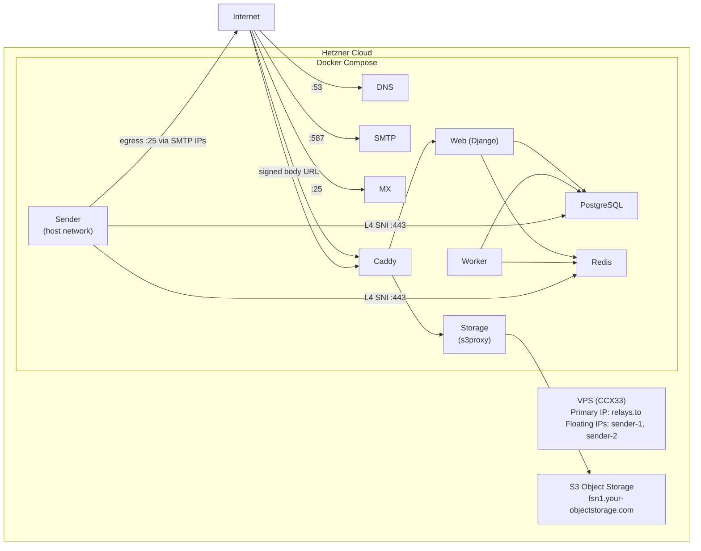

# Deploy relay on Hetzner with the hcloud CLI

Provision a Hetzner Cloud server with a pool of SMTP egress IPs for email
deliverability, Hetzner Object Storage for file storage, and deploy relay via
[the-box](https://github.com/codingjoe/the-box) (Docker Compose) with GitHub
Actions CI/CD.

`provision.sh` runs the steps in `steps/`, one script per step, in the order a
deployment needs them. Every step checks the resource it manages before it
changes anything, so a rerun skips what is done and picks up where the last run
stopped.

## Architecture



The sender runs on the host network so it can bind each pool address for
outbound delivery. Everything else stays on the Compose bridge.

Each floating IP publishes its own PTR record,
`sender-<n>.mail.<hostname>`. To rotate away from a blacklisted address,
replace it in both `RELAY_DNS_SMTP_IPS` and `RELAY_SMTP_SOURCE_IPS`.

## Prerequisites

The tools are already on the machine that runs this: `hcloud` 1.68, `aws` 2.36,
`jq` 1.8, `gh` 2.98, `dotenvx` 2.26, `envsubst`, `ssh-keygen` and `dig`. What
you need an account for:

- **A Hetzner Cloud API token** (Console → Security → API Tokens), with write
  access to zones, servers, floating IPs and SSH keys
- **Hetzner Object Storage credentials** (Console → Object Storage →
  Credentials)
- **`.env.keys`** in the repository root. It holds the private key that
  decrypts the committed `.env.production`, and it is git-ignored, so restore
  it from wherever you keep it before provisioning.
- **Your SSH public key**, for root access to the server
- **A domain** whose delegation you can change at the registrar

> [!IMPORTANT]
> Open outbound ports 25 and 465 before you cut over. The egress pool carries
> your outbound mail, so delivery depends on them. Once you have paid your
> first invoice you can open them in the Console; before that, request it
> through the support form with your use case.

## The provisioning steps

| Step          | What it does                                                               | What it needs from you            |
| ------------- | -------------------------------------------------------------------------- | --------------------------------- |
| `zone`        | Creates the Hetzner Cloud DNS zone                                         |                                   |
| `delegation`  | Waits until your registrar delegates the domain to the Hetzner nameservers | the delegation, at your registrar |
| `keys`        | Creates the deployment SSH key pair and uploads your SSH keys              |                                   |
| `egress`      | Creates the pool of floating IPs                                           |                                   |
| `server`      | Creates the server and assigns the pool to it                              |                                   |
| `records`     | Publishes the A records and the PTR records                                |                                   |
| `propagation` | Waits until public resolvers answer with those records                     |                                   |
| `storage`     | Creates the Object Storage bucket                                          | S3 credentials                    |
| `environment` | Writes the GitHub variables, secrets and `.env.production`                 | `gh` and `dotenvx`                |

```bash
./deploy/provision.sh              # run every step that is not done yet
./deploy/provision.sh records      # run one step, by name
./deploy/provision.sh --status     # what is done, what is pending, and when
./deploy/provision.sh --list       # the steps, in order
```

The order is the dependency order: the zone is what every later step is
verified against, the egress pool has to exist before the server boots with it,
and the records need an address the server only gets once it exists. A step
either changed something, reports `nothing to do`, or stops and halts the run
with what it needs. Rerunning the same command retries it.

### What the run remembers

The run writes what it created to `deploy/.state/`, which is git-ignored:
`state.env` holds the values of the deployment, and `steps/<name>` holds when
each step last ran and what it did.

Those files are a record, not a decision. Every step verifies the resource
itself, so deleting a record, a floating IP or the whole directory makes the
step run again rather than trust what was written.

### How stored mail is served

The bucket stays private and its endpoint is never handed to a browser. A
`storage` container runs [s3proxy](https://github.com/andrewgaul/s3proxy)
between Caddy and Hetzner Object Storage: relay signs a URL for the name Caddy
serves, Caddy routes it to the proxy, and the proxy carries the real
credentials to Hetzner.

So `AWS_S3_ENDPOINT_URL` in `.env.production` is the Hetzner endpoint, which the
proxy reads as its upstream, while `compose.production.yml` gives the
application containers `https://storage.<hostname>`. The zone's wildcard record
covers that name, so it needs no record of its own and Caddy issues its
certificate on first start.

## Step 1: Configure hcloud

```bash
HCLOUD_TOKEN="<your-hetzner-api-token>" hcloud context create relay --token-from-env
hcloud server list
```

## Step 2: Provision

Export the Object Storage credentials and run the entry point. It walks the
steps in order and stops at the first one that needs you, which is normally the
delegation: that step prints the nameservers to hand your registrar and waits
for them, so you can either set them while it waits or start the run again
later.

```bash
export AWS_ACCESS_KEY_ID="<your-s3-access-key>"
export AWS_SECRET_ACCESS_KEY="<your-s3-secret-key>"

RELAY_HOSTNAME="relays.to" \
    SSH_PUBLIC_KEY_FILES="$HOME/.ssh/id_ed25519.pub" \
    ./deploy/provision.sh
```

> [!TIP]
> A rerun resumes. Every step verifies the resource it manages before it
> changes anything, so a run that stopped keeps the work it did and never
> touches a credential that is already live.

> [!TIP]
> Only `storage` and `environment` read the credentials above, so the zone, the
> delegation and the server work before you have them.

It provisions a Hetzner Cloud server (CCX33, on Hetzner's `docker-ce` image:
Ubuntu 24.04 with Docker CE and the Compose plugin), a pool of floating IPs for
SMTP with a PTR record each, bound to `eth0` at first boot, a bucket on Hetzner
Object Storage, and the deployment SSH key pair at `deploy/id_ed25519`.

> [!CAUTION]
> The bucket holds stored mail. Emptying it deletes that mail.

### Overrides

Everything else is set for one server in `fsn1` on Hetzner's `docker-ce` image,
with its bucket in the same location. Three values are worth knowing before you
run it:

- `SMTP_FLOATING_IP_COUNT` (default `2`) sets the egress pool size. Raise it to
  keep a spare address for rotation, then run `./deploy/provision.sh egress records` to create the address and publish its records.
- `SERVER_TYPE` (default `ccx33`) and `SERVER_LOCATION` (default `fsn1`) pick
  the box. Override them when your account or location does not offer that
  type. The server step checks the pairing against the hcloud API before it
  creates anything.
- `S3_BUCKET` (default `relay-<hostname with dots as dashes>`) names the
  bucket. Bucket names are unique across Hetzner Object Storage, so override it
  when the derived name is taken.

## Step 3: Delegate DNS

The `zone` step creates the zone in Hetzner Cloud DNS and `delegation` hands
you the nameservers it returns. `records` writes these records, then
`propagation` waits for public resolvers to answer with them:

```
A  relays.to                 <server_ip>
A  sender-1.mail.relays.to   <smtp_ip_1>
A  sender-2.mail.relays.to   <smtp_ip_2>
A  mx1.relays.to             <server_ip>
A  mx2.relays.to             <server_ip>
A  ns1.relays.to             <server_ip>
A  ns2.relays.to             <server_ip>
A  *.relays.to               <server_ip>
```

The `sender-<n>.mail` records mirror the floating IPs, so raising
`SMTP_FLOATING_IP_COUNT` and running `egress` and `records` adds them.
Excluding an address from sending changes only `RELAY_DNS_SMTP_IPS` and
`RELAY_SMTP_SOURCE_IPS` in `.env.production`.

> [!IMPORTANT]
> Delegate `relays.to` to the nameservers `delegation` prints. Nothing in the
> zone resolves until your registrar points at them, and the step only passes
> once a public resolver answers with them. Confirm with
> `hcloud zone describe relays.to -o json | jq .authoritative_nameservers`,
> where `delegation_status` reads `valid` once it is right.

> [!IMPORTANT]
> Each `sender-<n>.mail` record has to match the PTR record on the same address.
> Receivers confirm a PTR by looking the name up forward, so these records are
> what make the pool verifiable. `records` checks both directions before it
> reports the work as done.

The `ns` and `mx` hostnames match `RELAY_DNS_NS_NAMESERVERS` and
`RELAY_DNS_MX_HOSTNAMES` in `root/settings.py`. The wildcard covers
`pg.<hostname>`, `redis.<hostname>` and `storage.<hostname>`, which the sender
and Caddy reach over the-box's Layer 4 SNI routes on `:443`. That is why the
sender's `DATABASE_URL` carries `sslmode=require` and its `REDIS_URL` uses
`rediss://`. Every other container reaches PostgreSQL and Redis over the bridge
by Docker DNS.

## Step 4: Add the OAuth credentials

The `environment` step writes the infrastructure values to `.env.production`.
GitHub OAuth credentials are user-specific and stay manual:

```bash
dotenvx set GITHUB_CLIENT_ID "<oauth-client-id>" -f .env.production
dotenvx set GITHUB_CLIENT_SECRET "<oauth-client-secret>" -f .env.production

git add .env.production
git commit -m "Add OAuth credentials"
git push
```

## Step 5: Deploy

```bash
gh workflow run deploy.yml
```

CI builds and pushes the image to ghcr.io, then the-box deploys via SSH.

## Step 6: Verify

```bash
curl https://relays.to/health/
openssl s_client -connect smtp.relays.to:587 -starttls smtp
dig MX relays.to @ns1.relays.to
dig +short pg.relays.to
dig +short redis.relays.to
dig +short storage.relays.to
```

The last three confirm the names the containers reach each other on.
`pg` and `redis` take Caddy's Layer 4 listener, which terminates TLS and
proxies to the internal ports, so spam scanning runs on the bridge, where the
worker reaches rspamd over the internal `caddy:11334` route. `storage` takes
the HTTPS listener, which proxies to the s3proxy container serving message
bodies, so a message download from the dashboard exercises it end to end.

## IP reputation and blacklist rotation

`RELAY_DNS_SMTP_IPS` and `RELAY_SMTP_SOURCE_IPS` carry the same addresses: the
floating IP pool plus the server primary IP. Web publishes them in SPF and
Return-Path records, and the sender picks one at random for each send. Set
`SMTP_FLOATING_IP_COUNT` high enough to keep a spare for rotation.

To rotate away from a blacklisted address:

1. Drop it from both values, in `.env.production`:

   ```bash
   dotenvx set RELAY_DNS_SMTP_IPS "<remaining IPs>,<server_ip>" -f .env.production -p
   dotenvx set RELAY_SMTP_SOURCE_IPS "<remaining IPs>,<server_ip>" -f .env.production -p
   git add .env.production && git commit -m "Switch SMTP IP" && git push
   ```

1. Track it at [MXToolbox](https://mxtoolbox.com/blacklists.aspx) and keep it
   assigned until it clears, then add it back the same way.

## Day-2 operations

```bash
hcloud server ssh relays.to          # log in over SSH
hcloud server metrics relays.to      # CPU, disk, network
hcloud server create-image --type snapshot --name relay-$(date +%F) relays.to
hcloud server enable-backup relays.to
hcloud floating-ip list -l relay=smtp -o columns=name,ip
hcloud all list --paid                        # everything that costs money
```

> [!IMPORTANT]
> `user_data` is applied at first boot. To grow the pool later, raise
> `SMTP_FLOATING_IP_COUNT`, run the `egress` and `server` steps to create and
> assign the addresses, then bind the new one on the server:

```bash
hcloud server ssh relays.to "sudo ip addr add <new_ip>/32 dev eth0"
```

## Diagnostics

Run these against a running box:

- `./deploy/provision.sh --status` shows which steps are done, which are
  pending, and when each last ran
- `hcloud server ssh <hostname> docker compose ps` shows container state
- `hcloud server ssh <hostname> ip addr show eth0` shows the bound pool
  addresses, which cloud-init adds at first boot and `networkd-dispatcher`
  re-adds on network events
- `hcloud server ssh <hostname> docker compose logs msa sender` shows
  submission and outbound delivery
- `hcloud server ssh <hostname> docker compose logs caddy` alongside
  `dig <hostname>` shows certificate issuance
- `dig +short pg.<hostname>` and `dig +short redis.<hostname>` show the
  sender's route to PostgreSQL and Redis
