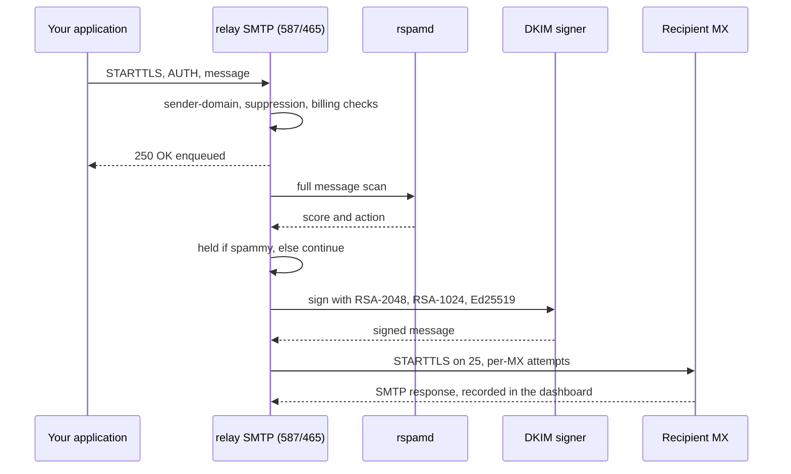

# Deliverability

Deliverability is the sum of every choice a receiving server sees: DNS
records, authentication, address hygiene, and message quality. relay manages
the infrastructure of all four. You focus on content and your recipient list.
This page explains what relay does and why each piece matters for the
receiver's decision.

## The record set relay manages

relay runs its own authoritative nameserver. For a delegated domain, for
example `acme.com`, you deploy the delegation and add DMARC, and relay serves
the rest. The dashboard lists the exact records, and its checks confirm each
one:

| Check         | Where relay looks                  | What it wants to see                                 |
| ------------- | ---------------------------------- | ---------------------------------------------------- |
| NS delegation | `mail.relay.acme.com`              | NS records to the relay nameservers                  |
| SPF           | root and sender subdomain TEXT     | a record that authorizes the relay sender host       |
| DKIM          | three CNAME records                | `{selector}._domainkey` pointing into the relay zone |
| DMARC         | `_dmarc.acme.com` TXT              | `v=DMARC1` with reporting to the relay collector     |
| MTA-STS       | `_mta-sts` TXT and `mta-sts` CNAME | `v=STSv1` record and relay policy host               |
| TLS-RPT       | `_smtp._tls` TXT                   | reporting to the relay TLS collector                 |

Six public-key selectors, three per domain (RSA-2048, RSA-1024, Ed25519),
sign every message with `h=sha256`. Multiple algorithms exist because some
older verifiers do not read Ed25519 names yet. All three signatures ride on
every outgoing message, so stricter receivers find a signature they accept.

## A working sender domain from signup

Every organization gets a managed sender domain at `{org}.open.{platform}`,
pre-verified and DKIM-signed, with all records served by the internal
nameserver. Your first message needs no DNS configuration. You can delegate
your own domains in parallel whenever you want your own domain in the
equation above.

## The delivery pipeline, step by step

Each step has a user-visible consequence in the dashboard, listed in the next
sections.

## Address hygiene: the suppression list

Every message gets a fresh Return-Path of the form
`bounce+{message-id}@{sender-subdomain}`, so every bounce points at one
message. When a recipient's server rejects a message permanently, relay
records the bounce, marks the message as bounced, and adds the address to
your suppression list. relay then refuses further sends to that address. The
submission still succeeds and the message is stored as suppressed, so your
application sees no error and no retry loop.

You can add entries manually, for example before a large import, and remove
entries if the address returns. Addresses store as salted SHA-256 hashes
only. See <a href="">Data
privacy</a> for what that means.

## Content quality: the outbound spam gate

Before delivery, rspamd scores each outgoing message. A message whose score
reaches the hold threshold stays HELD and does not reach the recipient. You
see the score, the spam action, and the message content in the dashboard, so
you can fix the template, not fight the queue. This gate catches compromised
credentials, broken templates, and spamtraps before they hurt your domain.

## When delivery fails

relay tries every MX host of the recipient domain in preference order and
records one transmission per attempt with the remote answer. The outcomes:

- **5xx answer**. The message is bounced. relay suppresses the address. The
  dashboard shows the exact SMTP answer.
- **No reachable MX or all hosts fail and no MTA-STS fallback**. The message
  is failed with the transcript.
- **Transport or storage problems**. The message is failed and the
  transcript shows where it stopped.

A 250 acceptance from your submission is not a delivery confirmation. The
dashboard's transmissions are the confirmation path.

## What your application sees

| SMTP reply you receive                           | Meaning                                        | Your move                                          |
| ------------------------------------------------ | ---------------------------------------------- | -------------------------------------------------- |
| 235 after AUTH                                   | Credential accepted                            | Proceed with the message                           |
| 530 Authentication required                      | Submission without TLS or without AUTH         | Use TLS before AUTH                                |
| 535 Authentication failed                        | Unknown org, wrong key, or held credential     | Check the key and its state                        |
| 250                                              | Accepted, delivery is queued                   | Nothing, watch the dashboard                       |
| 550 Sender domain not registered                 | From-domain does not belong to your org        | Register or fix the From address                   |
| 550 Recipient not allowed without active billing | Trial over, only org-member recipients allowed | Activate billing or use an internal member address |

## TLS and reputation inputs, briefly

MTA-STS enforcement, TLS-RPT collection, and the SPF/DKIM/DMARC alignment
above exist because receivers grade those signals. The sender-reputation page
explains why they are also your reputation story. Read
<a href="">Sender reputation</a>.

## Related pages

- <a href="">Sending</a>. The SMTP
  interface and all acceptance rules.
- <a href="">Reliability</a>. What
  happens when a step fails.
