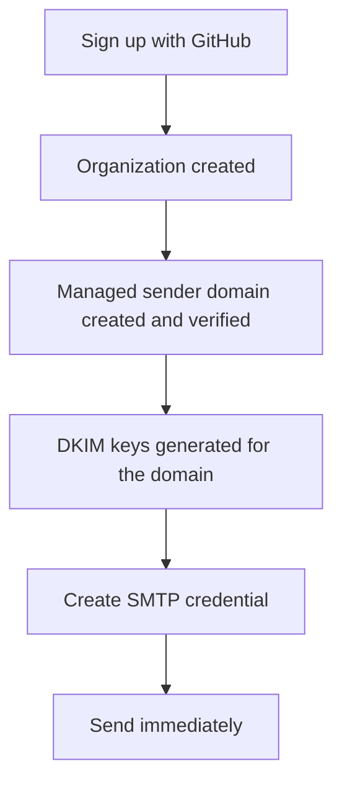
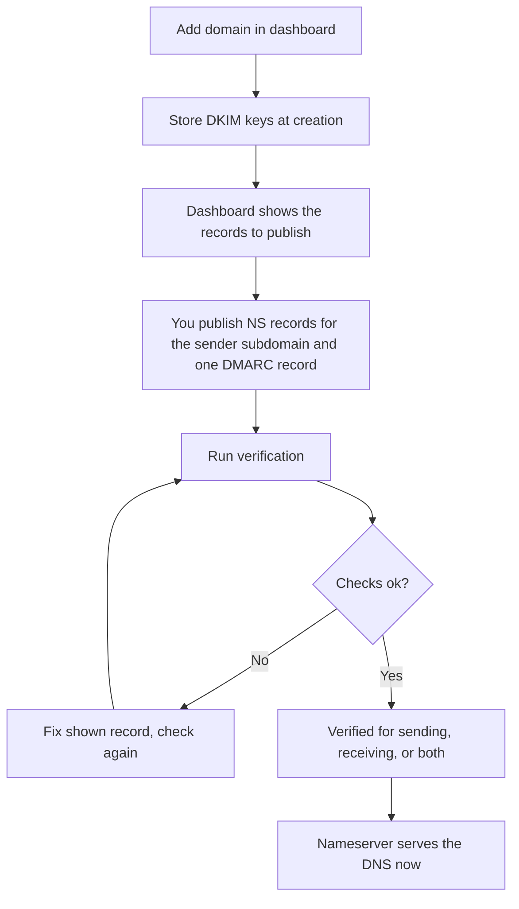

# Managed domains and DNS

Most email providers hand you a list of DNS records and hope you type them
correctly. relay ships its own authoritative nameserver. You prove ownership
of your domain once, and the nameserver serves the rest: MX, SPF, DKIM, DMARC
reporting addresses, MTA-STS, TLS-RPT, and the Return-Path zone. This page
explains the domain model, what relay serves in what name, and how
verification works.

## The domain model

| Kind                  | Example                       | Who creates it   | Purpose                                               |
| --------------------- | ----------------------------- | ---------------- | ----------------------------------------------------- |
| Managed sender domain | `acme.open.relay.example.com` | relay, at signup | Delegate with zero setup, pre-verified                |
| Your root domain      | `acme.com`                    | You              | Your own domain for From, envelope, and reporting     |
| Sending subdomain     | `mail.relay.acme.com`         | relay, derived   | The envelope and DKIM zone. NS delegation points here |
| Receiving domain      | `app.acme.com`                | You, as domain   | MX record points at the sender subdomain              |

Facts to understand about this model:

- **The sender subdomain exists once per root domain.** The envelope
  addresses, the DKIM zone, and the report collectors live under
  `{prefix}.{root}`. You delegate exactly that subdomain to the relay
  nameservers, and you add one DMARC record at your root.
- **Every root domain gets its own signing keys**: RSA-2048, RSA-1024, and
  Ed25519 keys, one selector each, at `relay-rsa2048`, `relay-rsa1024`, and
  `relay-ed25519` under `_domainkey`. Your domain signs with its own keys, so
  reputation attaches to your domain and not to someone else's.
- **Managed domains cannot be deleted** in the dashboard, and custom domains can.
- There can be no overlap: you cannot register a subdomain of the managed
  domain, and no two organizations can claim overlapping names.

## From signup to first send

Nothing in this path touches DNS configuration. The nameserver serves the
zone, the platform signs, and you send.

The platform signature comes from a platform domain row registered for the
operator's organization. Relay matches that platform domain by its name.
Once the platform domain exists, the nameserver serves its DKIM selectors
through the ordinary record path, and relay cosigns customer mail. Until
then, relay signs with the sending domain only.

## Adding your own domain

The flow for a user domain, for example `acme.com`:

Verification reads the live DNS for seven records and splits the result
into two independent purposes:

- Sending: NS delegation on the sender subdomain, SPF authorization, the
  three DKIM CNAMEs, and the DMARC record at the root.
- Receiving: the MX record at the root, the MTA-STS record and CNAME, and
  the TLS-RPT record with the relay reporting address.

Each purpose verifies on its own. Publish only the sending records and the
domain shows sending verified while receiving reads as not set up. Checks
run per record, and the dashboard shows each of them, so a wrong record is
identifiable. Re-check at any time.

## What the nameserver serves

For a delegated domain the authoritative nameserver answers:

| Query name (for acme.com)                 | Type  | Value served                              |
| ----------------------------------------- | ----- | ----------------------------------------- |
| `acme.com`                                | MX    | `mail.relay.acme.com`, preference 10      |
| `mail.relay.acme.com`                     | TXT   | SPF record for the relay sender addresses |
| `a.relay-acme._domainkey...` (both zones) | TXT   | DKIM public keys, one per algorithm       |
| `acme.com`                                | TXT   | root SPF include of the sender subdomain  |
| `_dmarc.acme.com`                         | TXT   | DMARC with relay reporting addresses      |
| `_dmarc.mail.relay.acme.com`              | TXT   | per-subdomain DMARC record                |
| `_mta-sts.acme.com`                       | TXT   | `v=STSv1` policy id                       |
| `mta-sts.acme.com`                        | CNAME | the relay policy host                     |
| `_smtp._tls...`                           | TXT   | TLS-RPT with the relay collector          |
| `mail.relay.acme.com`                     | NS    | the relay nameservers                     |

The dashboard always shows the current record set with concrete names and
the check state per record, so you never hand-edit names here.

## Receiving-domain notes

A domain can send and receive independently of each other. `app.acme.com` as
a receiving domain needs only its MX record to point at your sender
subdomain. Verification reflects this split: a setup without receiving
records reads as not set up, not as a failure. The webhook health check
shows the observed MX. Read the
<a href="">receiving</a> page for
the acceptance flow.

## Troubleshooting

| Symptom                                             | Likely cause                                       | Fix                                                   |
| --------------------------------------------------- | -------------------------------------------------- | ----------------------------------------------------- |
| NS check fails                                      | Delegation missing or typo in the NS records       | Publish the NS records from the dashboard instruction |
| DKIM CNAME check fails                              | CNAME not published yet or typo                    | Copy the selector names exactly                       |
| DMARC check fails                                   | No `v=DMARC1` at the root, wrong collector address | Publish the shown record                              |
| MTA-STS check fails                                 | TXT record wrong or CNAME missing                  | Publish both, wait for DNS propagation                |
| TXT merge needed                                    | Multiple TXT entries at the same name              | One entry per value, quoted as shown                  |
| Verification stays pending shortly after publishing | DNS caching                                        | Check again after the TTL of your zone                |

## Related pages

- <a href="">Encryption</a>. The
  MTA-STS policy served for your domains.
- <a href="">Webhooks</a>. Receiving
  setup from the application side.
