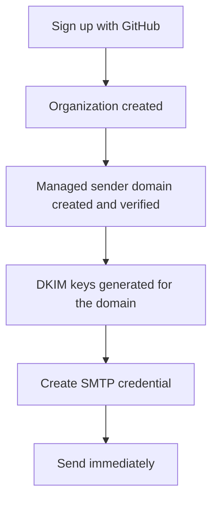
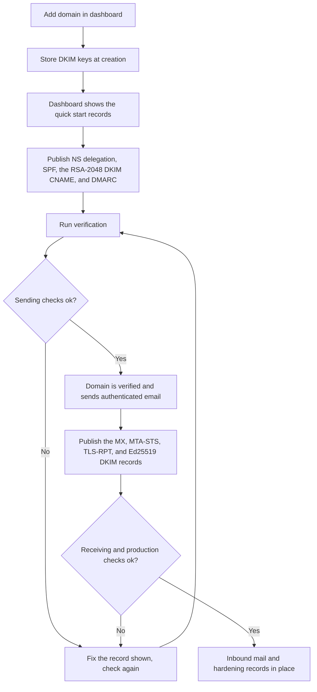

# Managed domains and DNS

Most email providers hand you a list of DNS records and hope you type them
correctly. relay ships its own authoritative nameserver. You prove ownership
of your domain once, and the nameserver serves the rest: MX, SPF, DKIM, DMARC
reporting addresses, MTA-STS, TLS-RPT, and the Return-Path zone. This page
explains the domain model, what relay serves in what name, and how
verification works.

## The domain model

| Kind                  | Example               | Who creates it   | Purpose                                                   |
| --------------------- | --------------------- | ---------------- | --------------------------------------------------------- |
| Platform domain       | `relays.to`           | The operator     | The relay infrastructure zone: MX, SMTP, and policy hosts |
| Managed sender domain | `acme.open.relays.to` | relay, at signup | Delegate with zero setup, pre-verified                    |
| Your root domain      | `acme.com`            | You              | Your own domain for From, envelope, and reporting         |
| Sending subdomain     | `mail.relay.acme.com` | relay, derived   | The envelope and DKIM zone. NS delegation points here     |
| Receiving domain      | `app.acme.com`        | You, as domain   | MX record points at the relay MX hostnames                |

In the examples, `acme.com` is your domain and `relays.to` is the relay
platform domain.

Facts to understand about this model:

- **The sender subdomain exists once per root domain.** The envelope
  addresses, the DKIM zone, and the report collectors live under
  `{prefix}.{root}`. You delegate exactly that subdomain to the relay
  nameservers, and you publish the quick start records at your root.
- **Every root domain gets its own signing keys**: RSA-2048 and Ed25519
  keys, one selector each, at `relay-rsa2048` and `relay-ed25519` under
  `_domainkey`. Your domain signs with its own keys, so
  reputation attaches to your domain and not to someone else's. relay signs
  every message with the RSA-2048 key, adds the Ed25519 signature once the
  domain is verified for sending and the Ed25519 CNAME check passes; only
  the RSA-2048 CNAME is required to send.
- **Managed domains cannot be deleted** in the dashboard, and custom domains can.
- There can be no overlap: you cannot register a subdomain of the managed
  domain, and no two organizations can claim overlapping names.

## From signup to first send

```mermaid
flowchart TD
    A[Sign up with GitHub] --> B[Organization created]
    B --> C[Managed sender domain created and verified]
    C --> D[DKIM keys generated for the domain]
    D --> E[Create SMTP credential]
    E --> F[Send immediately]
```

Nothing in this path touches DNS configuration. The nameserver serves the
zone, the platform signs, and you send.

The platform signature comes from a platform domain row registered for the
operator's organization. Relay matches that platform domain by its name.
Once the platform domain exists, the nameserver serves its DKIM selectors
through the ordinary record path, and relay cosigns customer mail. The
platform domain signs under the same rule as a customer domain: RSA-2048 on
every message, and Ed25519 only while it is verified for sending and its
Ed25519 CNAME check passes. Until the platform domain exists, relay signs
with the sending domain only.

## Adding your own domain

The flow for a user domain, for example `acme.com`, has two stages. The
quick start stage makes the domain send, and the production stage adds
inbound mail and the hardening records:

```mermaid
flowchart TD
    A[Add domain in dashboard] --> B[Store DKIM keys at creation]
    B --> C[Dashboard shows the quick start records]
    C --> D[Publish NS delegation, SPF, the RSA-2048 DKIM CNAME, and DMARC]
    D --> E[Run verification]
    E --> F{Sending checks ok?}
    F -- No --> G[Fix the record shown, check again]
    G --> E
    F -- Yes --> H[Domain is verified and sends authenticated email]
    H --> I[Publish the MX, MTA-STS, TLS-RPT, and Ed25519 DKIM records]
    I --> J{Receiving and production checks ok?}
    J -- No --> G
    J -- Yes --> K[Inbound mail and hardening records in place]
```

Verification runs eight checks on the live DNS and sorts the result into
three exclusive groups, one badge each:

- **Sending (quick start)**: NS delegation on the sender subdomain, SPF
  authorization, the RSA-2048 DKIM CNAME, and the DMARC record at the root.
  These four records are everything an email needs to reach a recipient
  authenticated, and the domain is verified as soon as they pass.
- **Receiving**: the MX record at the root, which routes inbound mail to
  relay.
- **Production**: the Ed25519 DKIM CNAME, the MTA-STS TXT record and its
  CNAME, and the TLS-RPT record with the relay reporting address. The
  MTA-STS check covers both of its records, and all three checks are
  optional: the domain sends without them. relay adds the Ed25519 signature
  only once the domain is verified for sending and the Ed25519 CNAME check
  passes.

The domain page gives each group its own section: sending in quick start,
receiving in its own, and production in its own. Every record
belongs to exactly one group, so a badge counts its own checks alone: the
production badge never counts a sending or receiving record, and it turns
on only when all three of its checks pass. Each group verifies on its own:
publish only the quick start records and the domain sends while the
receiving and production badges read as not set up.

Every check carries its own checkmark, so a wrong record is identifiable,
and the three groups each carry a badge. A verify click reports one message
for the first unfinished group in badge order: sending, then receiving,
then production. The message is an error naming the group and counting the
checks that still fail when you published part of it, reads not set up yet
when nothing in the group passed, and reports a pass only when every group
is complete.

## What the nameserver serves

For a delegated domain the authoritative nameserver answers:

| Query name (for acme.com)                 | Type  | Value served                                       |
| ----------------------------------------- | ----- | -------------------------------------------------- |
| `acme.com`                                | MX    | `mx1.relays.to` and `mx2.relays.to`, preference 10 |
| `mail.relay.acme.com`                     | TXT   | SPF record authorizing each relay sending IP       |
| `a.relay-acme._domainkey...` (both zones) | TXT   | DKIM public keys, one per algorithm                |
| `acme.com`                                | TXT   | root SPF include of the sender subdomain           |
| `_dmarc.acme.com`                         | TXT   | DMARC with relay reporting addresses               |
| `_dmarc.mail.relay.acme.com`              | TXT   | per-subdomain DMARC record                         |
| `_mta-sts.acme.com`                       | TXT   | `v=STSv1` policy id                                |
| `mta-sts.acme.com`                        | CNAME | `mta-sts.mail.relay.acme.com`                      |
| `_smtp._tls...`                           | TXT   | TLS-RPT with the relay collector                   |
| `mail.relay.acme.com`                     | NS    | the relay nameservers                              |

The dashboard always shows the current record set with concrete names and
the check state per record, so you never hand-edit names here.

The MTA-STS CNAME points at `mta-sts.mail.relay.acme.com`. That name sits
in the sender subdomain `mail.relay.acme.com`, which the relay nameserver
already serves. relay serves the policy over HTTPS and issues the
certificate for `mta-sts.acme.com` on the first fetch. You add no record
and no certificate for that name.

## Receiving-domain notes

A domain can send and receive independently of each other. `app.acme.com` as
a receiving domain needs only its MX record to point at your sender
subdomain. Verification reflects this split: a setup without receiving
records reads as not set up, not as a failure. The webhook health check
shows the observed MX. Read the
<a href="">receiving</a> page for
the acceptance flow.

## Troubleshooting

| Symptom                                             | Likely cause                                       | Fix                                                   |
| --------------------------------------------------- | -------------------------------------------------- | ----------------------------------------------------- |
| NS check fails                                      | Delegation missing or typo in the NS records       | Publish the NS records from the dashboard instruction |
| DKIM CNAME check fails                              | CNAME not published yet or typo                    | Copy the selector names exactly                       |
| DMARC check fails                                   | No `v=DMARC1` at the root, wrong collector address | Publish the shown record                              |
| MTA-STS check fails                                 | TXT record wrong or CNAME missing                  | Publish both, wait for DNS propagation                |
| TXT merge needed                                    | Multiple TXT entries at the same name              | One entry per value, quoted as shown                  |
| Verification stays pending shortly after publishing | DNS caching                                        | Check again after the TTL of your zone                |

## Related pages

- <a href="">Encryption</a>. The
  MTA-STS policy served for your domains.
- <a href="">Webhooks</a>. Receiving
  setup from the application side.
