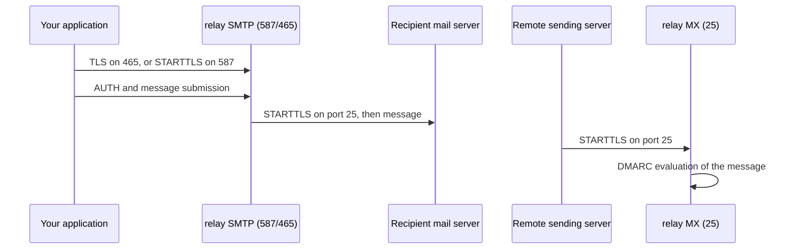

# Encryption

relay cannot make email end-to-end encrypted, because email is a
store-and-forward system and every mail server on the path reads the message.
What relay can do, and does, is encrypt every transmission hop, enforce the
policy that forbids downgrades, and keep every secret key encrypted at rest.
This page explains each mechanism and the limits of all of them.

## TLS on every hop

A relay message crosses up to three TLS-protected hops:

### Submission: your application to relay

Port 465 speaks TLS from the first byte. Port 587 requires the client to
negotiate STARTTLS before any AUTH or message exchange. relay accepts no
plaintext submission on either port. The stored message records whether the
submission arrived over TLS, so you can audit your own clients.

### Delivery: relay to the recipient

relay delivers with STARTTLS on port 25 to every MX host of the recipient
domain. If the recipient domain publishes an MTA-STS policy, relay fetches and
applies it before delivery. In `enforce` mode the policy forbids delivery to
hosts outside the list and allows only certificate-validated TLS. A network
attacker on the path to a protected domain cannot force plaintext.

The policy itself is standard: `v=STSv1` with a policy identifier, a
max-age of 7 days (604800 seconds), and the list of valid MX hostnames. See
the know-how article on <a href="">MTA-STS</a>
for the full protocol details.

### Inbound: senders to relay

Remote servers deliver inbound email to the relay MX on port 25 with
STARTTLS. relay publishes the TLS certificate for the MX host and records for
each message whether it arrived over TLS, together with the protocol version
and cipher suite, and the certificate the sender presented when one was
offered. relay publishes MTA-STS and TLS-RPT
records for your domains, which asks all senders to use TLS as well.

## The MTA-STS policy

For every managed or delegated domain, relay serves the DNS record and the
policy file:

- the TXT record at `_mta-sts.{your-domain}` carrying the policy id that
  matches the policy host,
- a CNAME at `mta-sts.{your-domain}` into the relay policy host,
- the policy document at
  `https://mta-sts.{your-domain}/.well-known/mta-sts.txt`.

The policy document sets `mode: enforce`, a max-age of 7 days, and the relay
MX hostnames as the only valid delivery targets. The policy id changes when
the policy changes. A sender that caches the policy therefore trusts relay
MX names and rejects downgrade attempts for your domain.

## DMARC: consent on the receiving side

When a remote server submits a message to your delegated domain, relay
evaluates the sender's own DMARC policy before acceptance. A domain that
publishes `p=reject` gets its failing messages rejected at the SMTP level.
This protects you from spoofed-looking inbound mail and protects senders from
being quoted as senders of failing mail.

## Authentication in transit

Transport encryption protects the connection, and DKIM protects the message
itself. relay signs every outgoing message with DKIM over the headers From,
To, Subject, Date, and Message-ID, with SHA-256. A receiving server verifies
the signature against your public key in DNS. Any change to these headers in
transit breaks the signature and becomes visible. See the know-how article on
<a href="">DKIM</a>.

## Signers key material at rest

relay keeps every private signing key encrypted at rest:

- DKIM private keys (one RSA-2048 and one Ed25519 key per
  domain) are Fernet-encrypted before storage,
- each webhook carries its own Ed25519 signing keypair, encrypted the same
  way,
- only public keys appear in DNS or the dashboard.

An attacker with database access obtains ciphertexts, not signing power.

## Message storage

relay stores message metadata in PostgreSQL and raw message bodies in
object storage, in the same Hetzner Nuremberg region as everything else.
Bodies are not stored longer than delivery needs. See the
<a href="">privacy policy</a> for retention rules.

## What relay cannot encrypt

Email is a store-and-forward system. Every server on the path reads the
message.
relay cannot create end-to-end confidentiality without breaking the protocol.
If your threat model requires it, encrypt at the application layer before
submission, for example with S/MIME or PGP, and let relay carry the
ciphertext. Signing and auth still work on the carrier envelope.

## Related pages

- <a href="">Sending</a>. The delivery
  pipeline in detail.
- <a href="">Receiving</a>. Inbound
  DMARC and spam handling.
