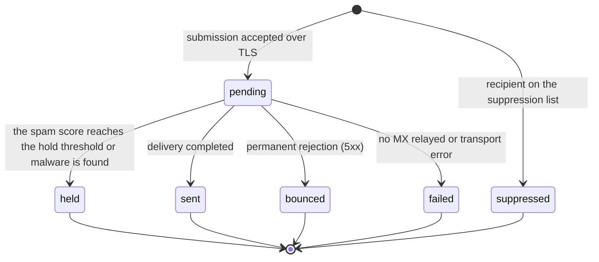
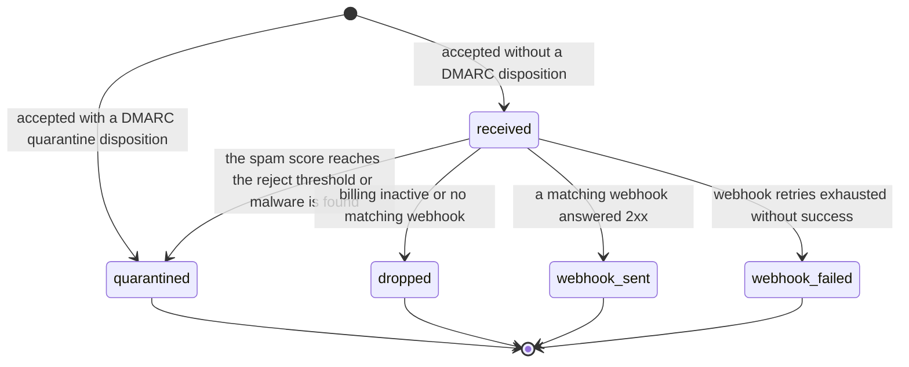

# Message statuses

Every message in the dashboard carries exactly one status. The status tells
you where the message stands, what relay will still do with it, and which steps need a
human decision. This page shows both state machines as diagrams and
explains each transition. Every transition in the diagrams maps to real code
paths.

Two state machines exist: one for outbound messages, and one for inbound
messages. A per-attempt record (a Transmission for deliveries, a Webhook
Delivery for webhook POSTs) sits next to each message with its own outcome,
so a final status never erases the history of the attempts behind it.

## The life of an outbound message

| Status     | Trigger                                                                                                    | What happens next                                              |
| ---------- | ---------------------------------------------------------------------------------------------------------- | -------------------------------------------------------------- |
| pending    | Stored after a `250` acceptance, before the spam scan finishes                                             | The worker scans, signs, and delivers                          |
| suppressed | The recipient address is on the suppression list at submission                                             | Terminal state, no delivery attempt, visible in the dashboard  |
| sent       | At least one recipient MX host accepted the message after STARTTLS                                         | Final state, the transmission records keep the SMTP transcript |
| bounced    | A recipient server answered with a permanent 5xx rejection                                                 | Final state, relay suppresses the address automatically        |
| failed     | No MX records, a failed lookup, every MX host failed, or a transport or storage error stopped the pipeline | Final state, the attempts keep every reason                    |
| held       | The scan rejects the action, the score reaches the hold threshold, or malware is found                     | Final state until a human sees the dashboard                   |

Notes on reading the diagram:

- A submission puts a message into `pending`, and only a suppressed
  recipient short-circuits that path at submission time. A suppressed
  message is a successful SMTP conversation with no delivery, on purpose.
- `pending` is the only state with an open movement, so every other state
  comes from the pipeline after acceptance.
- `bounced` and `failed` differ by who is responsible: a remote rejection
  ends as `bounced`, and relay-side transport problems end as `failed`.
- `sent` is the strongest final state relay can know: the recipient MX
  accepted the message. Confirmed recipient delivery is not tracked, and
  the enum has no such state.

## The life of an inbound message

| Status         | Trigger                                                                                                                    | What happens next                                                 |
| -------------- | -------------------------------------------------------------------------------------------------------------------------- | ----------------------------------------------------------------- |
| received       | Stored after acceptance, before the inbound spam check finishes                                                            | The scan runs, then webhooks fire                                 |
| quarantined    | A DMARC quarantine disposition at acceptance, a spam score at or above the reject threshold, or a message the scan rejects | Final state, no webhook, readable in the dashboard with its score |
| dropped        | Billing is inactive, or no active webhook matches the recipient                                                            | Final state, the message stays stored                             |
| webhook_sent   | A POST to a matching active webhook answered 2xx                                                                           | Final state, the delivery record shows the response               |
| webhook_failed | The Standard Webhooks retry schedule ended without a 2xx, or the webhook was inactive or answered 410                      | Final state, every attempt is in the delivery record              |

Two details worth knowing:

- A message with a `p=reject` DMARC disposition never enters these states.
  relay rejects it inside the SMTP transaction, and it never becomes a
  stored message.
- The 410 answer of a webhook is special: 410 tells a caller that the
  endpoint is gone. It deactivates the webhook for future traffic, and the
  message ends as `webhook_failed`.

## The attempt records under the status

The transmission list per message shows each attempt with its own outcome:

| Transmission status | Meaning                                                           |
| ------------------- | ----------------------------------------------------------------- |
| received            | relay accepted the message over inbound SMTP                      |
| submitted           | relay accepted the message for delivery                           |
| sent                | This attempt reached a recipient MX host that answered success    |
| bounced             | This attempt revealed a permanent rejection                       |
| failed              | This attempt failed, and the row names the MX host and the reason |
| retry               | Reserved for future automatic retry tracking                      |

One delivery walk produces one row per MX host it reached. A failed
delivery therefore keeps the answer of every host it tried, including the
hosts MTA-STS rejected and the lookup that found no host at all. An attempt
that dials a host also keeps the sending IP it used, so a receiver that
blocked one address of the pool is visible on the attempt.

The message detail page also draws these records on a timeline. Each bar
spans the time relay measured for that attempt: a reception bar covers the
inbound SMTP transaction, a submission bar covers the outbound SMTP
transaction, and a delivery bar covers one attempt at an MX host, including
the MTA-STS check and the SMTP session with that host. The attempt that
found no host to try covers the MX lookup instead. The gaps between bars
show how long the message waited in the queue or between retries. Green bars mark successful attempts, red bars mark failures, and
yellow bars mark retries. Blue bars mark the reception and submission legs.
The spam check bar takes the color of its verdict: green when the message
is clean, yellow when the scan holds or rewrites it, red when it rejects it,
and gray when the check failed. When the scanner measured the malware scan,
the check bar also carries a shaded segment for it. The width of that
segment is the share of the check the scan took, never a place inside the
check, because the scanner reports how long the scan ran and not when it
started. Hover a bar to see its duration in milliseconds, its exact start
and end times, the IP path, and the negotiated TLS settings. The spam check
bar adds the spam score and the share the malware scan took. Click a bar to
open the full SMTP transcript.

The same applies for inbound messages: one delivery record per webhook POST
with the URL, response code, and a response excerpt.

## Where you see the statuses

- The message list of the dashboard colors each status badge with the
  same traffic-light tones as the charts: success for sent, received,
  and webhook_sent, warning for held and quarantined, destructive for
  bounced, failed, dropped, and webhook_failed, and outline for
  everything still open or neutral.
- The message list graphs the last 30 days of messages by status. The sent
  view graphs outgoing messages, the received view graphs incoming
  messages, and the unfiltered view graphs both in one chart: outgoing bars
  above the axis and incoming bars below it. The graph counts the same
  messages the filters select.
- The message detail page shows the status next to the transcripts and
  delivery records, and leads with a status card: the same status in the
  traffic-light colors of its badge, how long the delivery took, and when the
  last attempt finished.
- Filters let you watch only failed or quarantined traffic.

## The antivirus badge

The message detail page carries a second badge for the malware scan that
runs on every message alongside the spam score:

| Badge          | Meaning                                                                      |
| -------------- | ---------------------------------------------------------------------------- |
| no virus       | The scan ran and found nothing                                               |
| virus: name    | The scan found a virus, and the badge names it                               |
| encrypted part | The scan could not read a password-protected attachment                      |
| macro          | The scan could not inspect an attachment that carries Office macros          |
| scan limits    | The attachment exceeded what the scanner inspects, so part of it went unseen |
| not scanned    | No scan has completed for the message yet, or the scan is still retrying     |

An encrypted part, macros, and exceeded limits all hide content from the
scanner, so relay treats them as a detection and holds or quarantines the
message. The badge stays on not scanned until a scan completes, so a message
that is still queued and a message whose scan keeps failing both show that
state. The scanner reports only what it finds, so no virus means the scan
finished without a finding, and it does not promise that every attachment
was readable.

## Related pages

- <a href="">Sending</a>. The SMTP
  interface that starts the outbound state machine.
- <a href="">Reliability</a>.
  What relay does on each failure path.
- <a href="">Receiving</a>. The gates
  that produce the inbound states.
