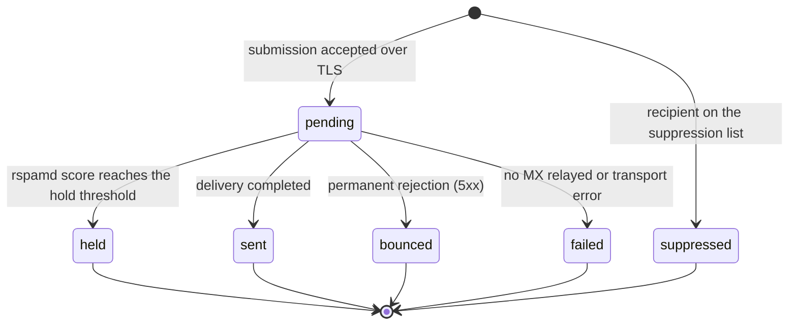
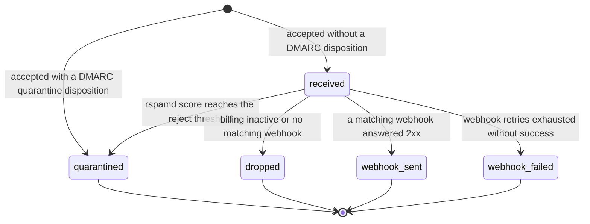

# Message statuses

Every message in the dashboard carries exactly one status. The status tells
you where the message stands, what relay will still do with it, and which steps need a
human decision. This page shows both state machines as diagrams and
explains each transition. Every transition in the diagrams maps to real code
paths.

Two state machines exist: one for outbound messages, and one for inbound
messages. A per-attempt record (a Transmission for deliveries, a Webhook
Delivery for webhook POSTs) sits next to each message with its own outcome,
so a final status never erases the history of the attempts behind it.

## The life of an outbound message

| Status     | Trigger                                                                                   | What happens next                                              |
| ---------- | ----------------------------------------------------------------------------------------- | -------------------------------------------------------------- |
| pending    | Stored after a `250` acceptance, before the spam scan finishes                            | The worker scans, signs, and delivers                          |
| suppressed | The recipient address is on the suppression list at submission                            | Terminal state, no delivery attempt, visible in the dashboard  |
| sent       | At least one recipient MX host accepted the message after STARTTLS                        | Final state, the transmission records keep the SMTP transcript |
| bounced    | A recipient server answered with a permanent 5xx rejection                                | Final state, relay suppresses the address automatically        |
| failed     | No MX records, every MX host failed, or a transport or storage error stopped the pipeline | Final state, the last transcript explains why                  |
| held       | rspamd rejects the action or the score reaches the hold threshold                         | Final state until a human sees the dashboard                   |

Notes on reading the diagram:

- A submission puts a message into `pending`, and only a suppressed
  recipient short-circuits that path at submission time. A suppressed
  message is a successful SMTP conversation with no delivery, on purpose.
- `pending` is the only state with an open movement, so every other state
  comes from the pipeline after acceptance.
- `bounced` and `failed` differ by who is responsible: a remote rejection
  ends as `bounced`, and relay-side transport problems end as `failed`.
- `sent` is the strongest final state relay can know: the recipient MX
  accepted the message. Confirmed recipient delivery is not tracked, and
  the enum has no such state.

## The life of an inbound message

| Status         | Trigger                                                                                               | What happens next                                                 |
| -------------- | ----------------------------------------------------------------------------------------------------- | ----------------------------------------------------------------- |
| received       | Stored after acceptance, before the inbound spam check finishes                                       | The spam scan runs, then webhooks fire                            |
| quarantined    | A DMARC quarantine disposition at acceptance, or a spam score at or above the reject threshold        | Final state, no webhook, readable in the dashboard with its score |
| dropped        | Billing is inactive, or no active webhook matches the recipient                                       | Final state, the message stays stored                             |
| webhook_sent   | A POST to a matching active webhook answered 2xx                                                      | Final state, the delivery record shows the response               |
| webhook_failed | The Standard Webhooks retry schedule ended without a 2xx, or the webhook was inactive or answered 410 | Final state, every attempt is in the delivery record              |

Two details worth knowing:

- A message with a `p=reject` DMARC disposition never enters these states.
  relay rejects it inside the SMTP transaction, and it never becomes a
  stored message.
- The 410 answer of a webhook is special: 410 tells a caller that the
  endpoint is gone. It deactivates the webhook for future traffic, and the
  message ends as `webhook_failed`.

## The attempt records under the status

The transmission list per message shows each attempt with its own outcome:

| Transmission status | Meaning                                                        |
| ------------------- | -------------------------------------------------------------- |
| sent                | This attempt reached a recipient MX host that answered success |
| bounced             | This attempt revealed a permanent rejection                    |
| failed              | This attempt failed, and the transcript shows why              |
| retry               | Reserved for future automatic retry tracking                   |

The same applies for inbound messages: one delivery record per webhook POST
with the URL, response code, and a response excerpt.

## Where you see the statuses

- The message list of the dashboard colors each status badge with the
  same traffic-light tones as the charts: success for sent, received,
  and webhook_sent, warning for held and quarantined, destructive for
  bounced, failed, dropped, and webhook_failed, and outline for
  everything still open or neutral.
- The message detail page shows the status next to the transcripts and
  delivery records.
- Filters let you watch only failed or quarantined traffic.

## Related pages

- <a href="">Sending</a>. The SMTP
  interface that starts the outbound state machine.
- <a href="">Reliability</a>.
  What relay does on each failure path.
- <a href="">Receiving</a>. The gates
  that produce the inbound states.
