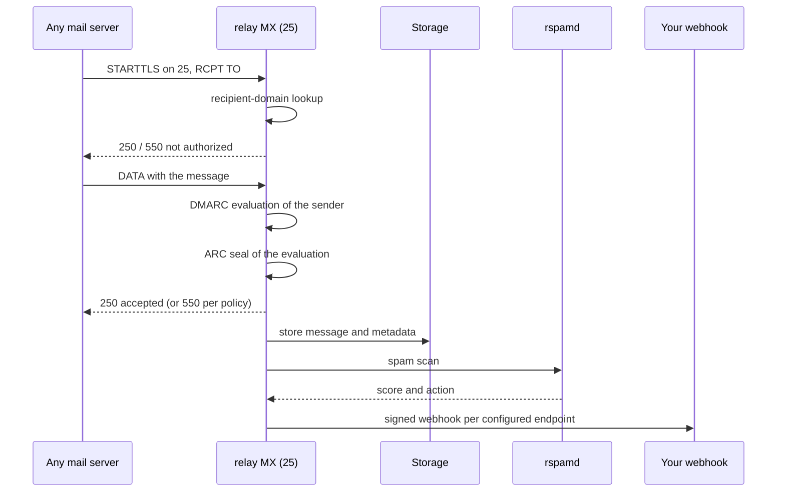

# Receiving

relay operates a real MX server. Any internet mail server can deliver a
message to your delegated or managed domains. relay validates the recipient,
checks the message's own authentication claims, filters spam, and dispatches
the result to your webhooks. This page explains each stage.

## The one-time receiving-domain setup

Point the MX record of your receiving domain at your sender subdomain, for
example `MX app.acme.com` to `mail.relay.acme.com`. The relay nameserver
serves that subdomain's zone, so the MX host and its TLS records exist
without further work. The dashboard's webhook check shows a wrong MX
record, with the observed value and the time of the last check.

Inbound flow:

## The acceptance gates

**Recipient check.** relay accepts only domains registered to your
organization, resolved through the root domain, including managed domains.
Anything else answers `550 Relay not authorised for this recipient`.

**Inbound DMARC.** relay reads the DMARC policy of the message's own sender
domain. A `p=reject` policy fails the SMTP transaction with
`550 Message rejected by DMARC policy`. The message never enters the
platform. Quarantine policies mark the stored message as quarantined. This
protects senders that publish strict policies from having their name abused,
and it protects your inbox from spoofing attempts. relay signs outgoing mail
with RSA-2048 and Ed25519 keys, but inbound DKIM verification still accepts
signatures from older senders that use RSA-1024 keys.

**Spam scan.** rspamd scores every accepted message. A message whose
score reaches the reject threshold, or whose action is reject, lands as
quarantined and never reaches your webhook. You can see the score in the
dashboard.

## ARC sealing

relay records its SPF, DKIM, and DMARC evaluation of every accepted
message in the stored raw message, and seals that evaluation with an ARC
set ([RFC 8617][rfc-8617]). The set consists of an ARC-Authentication-Results header
that mirrors relay's evaluation, an ARC-Message-Signature over the
message, and an ARC-Seal over the chain of earlier seals. The seal names
the receiving MX host as the evaluator. The receiving domain's DKIM key
signs the set with an RSA-2048 signature, so anyone can verify the seal
with the public key that relay's nameserver publishes at the selector's
domain-key address.

Sealing protects the recorded verdict from forgery.
Authentication-Results headers that claim relay's MX host, and headers
that cannot be parsed, are removed before sealing, so a spoofed or
broken verdict cannot survive in relay's name.

Forwarded mail often arrives with an ARC chain from earlier hops. relay
verifies the existing chain and continues it with its own set. A chain
that validates becomes pass, a broken one becomes fail, and the verdict
is recorded within relay's own evaluation, so the next receiver can
judge the full forwarding path. A chain that an earlier hop already
sealed as failed is not extended; relay records the failure in its own
evaluation instead.

Sealing happens before the message is stored, so the raw message opened
in the dashboard or downloaded through a webhook's signed body URL
contains the complete header set. The message detail page shows relay's
evaluation as per-method verdicts (ARC, SPF, DKIM, DMARC) and lists the
seals of the ARC chain, upstream evaluations included, verbatim. See the
know-how article on
<a href="">ARC</a> for the protocol
background.

## Special recipient addresses

Your delegated domain receives report traffic automatically:

| Address                    | Purpose                         | What relay does                              |
| -------------------------- | ------------------------------- | -------------------------------------------- |
| `dmarc@{sender-subdomain}` | DMARC aggregate reports (RUA)   | Store, parse the XML, show in the dashboard  |
| `ruf@{sender-subdomain}`   | DMARC failure reports (RUF/ARF) | Store, parse, show in the dashboard          |
| `tls@{sender-subdomain}`   | TLS-RPT reports                 | Store, parse the JSON, show in the dashboard |
| `postmaster` (+extensions) | Human mail to postmaster        | Store, and notify your team                  |

These addresses exist because your DMARC and DNS records must name a
collector, and relay is that collector. You see who authenticates as your
domain, who fails, and which servers have TLS trouble.

The MAIL-lifetime of a normal message begins at acceptance. relay stores
it with its metadata, marks it received (or quarantined), and processes it
asynchronously.

## What happens after the spam scan

A clean message goes to the matching active webhooks of the receiving domain.
The dispatch rules:

- the webhook must belong to the receiving domain, and its address pattern,
  for example `*@app.acme.com` or `support@acme.com`, matches the recipient,
- relay delivers the message to each matching webhook with the Standard
  Webhooks
  signature scheme,
- without active billing the status becomes dropped, without matching
  webhooks it becomes dropped as well.

If no webhook matches, the message stays stored with the status DROPPED, and
you can still read it in the dashboard.

## Postmaster handling

relay stores messages to `postmaster@{your-domain}` and dispatches them
like any other, with one addition: relay notifies the organization's members about
postmaster mail, because [RFC 5321][rfc-5321] requires postmaster to be reachable.

## Reading arriving mail

The dashboard lists all inbound messages with sender, recipient, TLS state,
spam score, and status. The raw message lives in storage and stays reachable
from the dashboard view. Retention follows the
<a href="">data-privacy</a> page.

## Related pages

- <a href="">Webhooks</a>. Payload,
  signatures, and retry behavior.
- <a href="">Managed domains and
  DNS</a>. How the MX record gets proper delegation.

[rfc-5321]: https://www.rfc-editor.org/info/rfc5321/
[rfc-8617]: https://www.rfc-editor.org/info/rfc8617/
