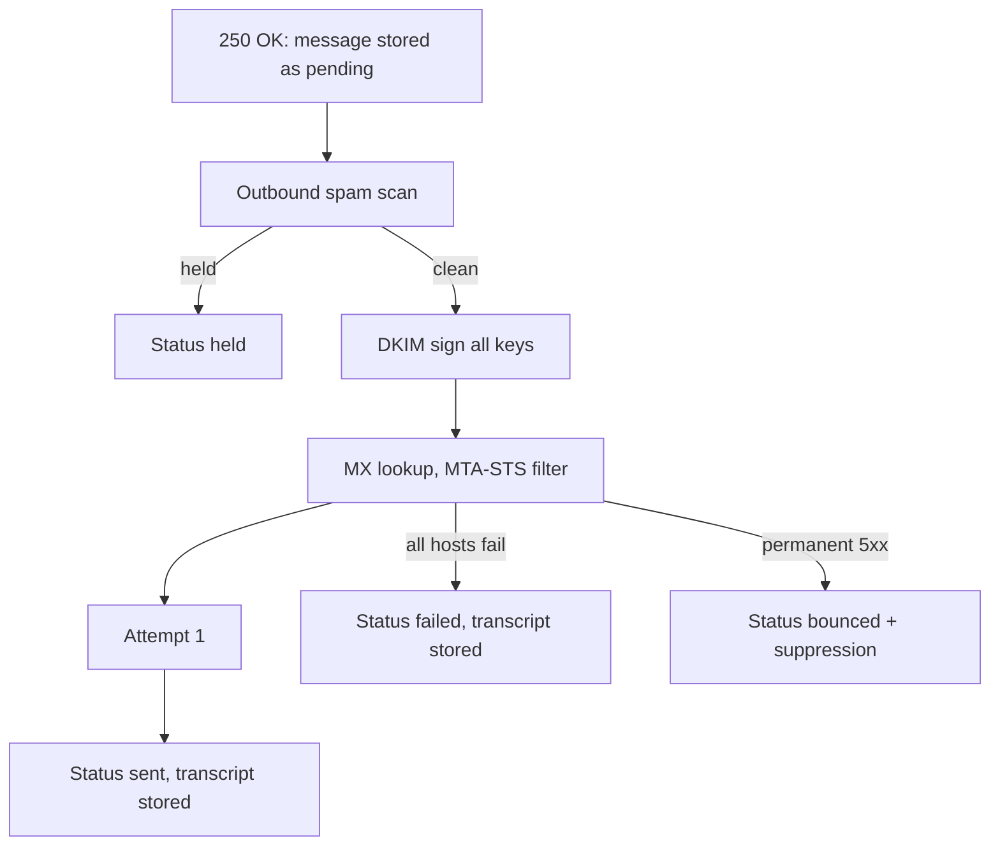
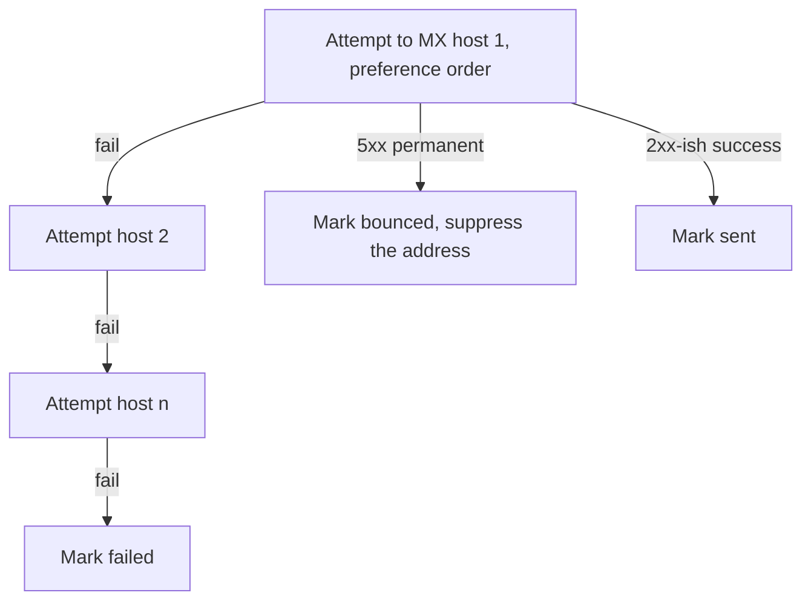

# Reliability

Email must survive restarts, dead MX hosts, failing endpoints, and slow
recipients. relay queues everything, records every attempt, and retries
according to definable schedules. This page is the reliability manual. It explains
the failure paths, and how you observe each of them.

## The queue model

relay stores your submission before any processing:

Message storage comes before any delivery logic. If a process dies between
acceptance and delivery, the message is still there: the worker picks it up
from the queue state, performs through an attempt, and records the attempt.

## Transmission records

Every accepted submission and every delivery attempt produces one immutable
transmission row with:

- the time the leg started and the time it finished, so the dashboard can
  plot real attempt durations,

- the submission row records the acceptance answer and whether the
  submission arrived over TLS,

- a sent attempt records the attempted MX host, the TLS details of the
  connection: STARTTLS or TLS, the protocol version, the cipher suite, and
  the certificate the remote server presented, identified by its SHA-256
  fingerprint, with its subject, alternative names, issuer, serial number,
  validity window, and certificate chain, and both IP addresses of the
  delivery connection: the address relay sent from and the address of the MX
  that handled the attempt,

- the SMTP status code and the complete answer text,

- a failed attempt records the MX host and the reason relay saw: the SMTP
  answer, the MTA-STS policy that rejected the host, the transport error, or
  the lookup that found no host to try at all.

Failures become visible with their reasons instead of disappearing. relay
also logs every delivery outcome with the message ID, the recipient, the
host it reached, and the reason, so a support thread is traceable in the
log. Support starts from those facts, not from memories.

## How failure path work

- **Multiple MX hosts.** relay walks the MX list by preference and skips
  hosts that MTA-STS rejects, so a single broken host does not block
  delivery. Every host it tried or skipped keeps its own row with the reason,
  so a failed message never hides which host said what.
- **No MX records found** results in a clear failure, not in a silent drop.
  A lookup that fails instead of answering, for example a resolver timeout,
  is recorded as a lookup failure and never as a missing record.
- **Permanent (5xx) answers bounce immediately** and feed the automatic
  suppression list, including a rejected recipient on the envelope. No retry
  storm at an unwilling receiver.
- **Temporary (4xx) answers** are recorded against the host that gave them,
  and relay tries the next MX host. The message ends failed only when every
  host answered with a temporary failure, and it keeps every answer for
  diagnosis.

## Automatic retry schedules

relay defines explicit retry behavior for external systems:

| Action                | Schedule                                                 | Notes                            |
| --------------------- | -------------------------------------------------------- | -------------------------------- |
| Spam and malware scan | Retried for about a day                                  | Delays mail instead of losing it |
| Webhook delivery      | 10 attempts, immediate up to 24 h gaps, about 75 h total | 0 to 29 s jitter on every retry  |

Webhook retries stop early on success. Every delivery attempt carries its
URL, response code, and a response excerpt of 2,000 characters, so an
endpoint misbehavior shows as data.

## Observability of failures

- **Errors go to Sentry**, all processes share one project, off by default.
  No message bodies, no credentials, no tokens travel there.
- **Dashboard transmissions** show each outbound attempt with its SMTP
  conversation.
- **Webhook delivery rows** show inbound webhook status.
- **Inbound quarantine** contents stay readable, with the spam score visible.

## Operational notes for high-volume senders

- Answer webhook endpoints fast. The retry schedule shows why slow endpoints
  cost you minutes-to-days of redelivery delay.
- Distinguish bounce types where it matters: a "550 mailbox unknown" answer
  in the dashboard transcript is final, do not wait it out. The suppression
  already protects you.

## Related pages

- <a href="">Sending</a>. Statuses and
  SMTP replies in detail.
- <a href="">Webhooks</a>. The full
  retry table and verification code.
