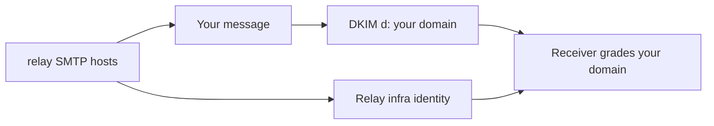
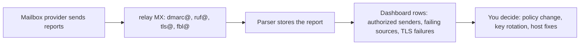

# Sender reputation

Mailbox providers grade each sending domain on authentication, complaint
rates, bounce rates, spam rates, and infrastructure hygiene. Those grades
decide whether your mail lands in the inbox, in a quarantine folder, or in
the void. relay manages the infrastructure half of that list directly and
gives you visibility on the rest. This page explains how reputation is built
and monitored under relay.

## Your domain carries your reputation

relay signs each outgoing message with your own domain's DKIM keys. A
receiving server attributes the message to your DKIM domain, not to the
platform. The envelope sender lives on your sender subdomain, so SPF
attribute as well, and DMARC alignment for `p=quarantine` and stricter
policies is the default case, not an achievement.

Two things matter in that graph:

- **Your domain carries your reputation.** Other relay customers cannot
  harm your domain's grade, because signatures are not shared and the sending
  identity differs.
- **The infrastructure identity stays consistent.** The relay SMTP servers
  identify with hostnames that match their PTR records, so receivers see one
  stable, verified platform identity, which also protects your domain from
  strangers sending as "you".

Consequences for migration: a domain that switches to relay does inherit its
domain reputation, not a platform record, so make sure the domain is in good
standing first.

## Keeping bounce rates near zero

Bounce rates are the fastest reputation killer. The suppression list keeps
yours low:

- every Return-Path carries a per-message id, so bounces map to one message,
- a permanent 5xx adds the address to the suppression list immediately,
- all further submissions to that address store as suppressed, with no error
  back to your application, so retry loops cannot amplify the bounce rate,

Pre-warm an address list with a suppression import or use org-member
recipient mode before billing goes live. Suppression import and API removal
are on the roadmap. The dashboard covers adding and removing entries today.

## Keeping spam from your assets

relay scans outbound mail before it leaves, and held messages do not reach a
recipient. This gate exists because a single compromised credential or a
single broken template can damage a domain for weeks. See the
<a href="">delivery
pipeline</a> for where the gate sits.

## Protocol completeness

Receivers grade partially-configured domains harshly. relay removes the
partial-configuration failure mode:

- All records get served from one nameserver, so records exist on first send
  and no stale DNS haunts a domain.
- MTA-STS ships in enforce mode: receivers that trust the policy reject
  downgrade paths.
- TLS-RPT reporting gives receivers a signal channel, and failures show
  themselves in your dashboard as actionable rows.
- DMARC publishes reporting to relay's collectors, so the spoofing picture is
  always visible.

## The reporting loop

Mailbox providers report back to the addresses in your DMARC and TLS-RPT
records. relay collects and processes them:

Four report types arrive:

- **DMARC aggregate (RUA)**. Daily XML with every check result of a
  provider's inbound for your domain.
- **DMARC forensic (RUF/ARF)**. A failing message sample, redacted or not
  per policy.
- **TLS-RPT.** JSON with the success and failure counts of sender TLS
  attempts against your MTA-STS surface.
- **Feedback loop (FBL).** An abuse report in the ARF format. A provider
  sends it when a recipient marks one of your messages as spam.

The dashboard surfaces each report type, per domain, and records whether a
report arrived over TLS.

FBL complaints need a proof before they count against your organization.
The report carries the per-message Return-Path, or the per-message
`Feedback-ID` header of the reported message. relay matches that id, so a
complaint maps to one message, one domain, and one organization. A complaint
without this proof stays on record, and it does not count into the rates.

## Reputation limits

relay computes hard-bounce and complaint rates for your organization over a
rolling window. Two rates drive the decision: the hard-bounce rate and the
complaint rate. If one of the rates goes above its threshold, and the
message volume in the window is large enough, relay suspends the
organization. A suspension rejects new submissions with a 550 answer, and
drops queued messages. The suspension never lifts by itself. relay sends
mail to the organization admins and to relay staff when it suspends an
organization.

## The reputation loop in practice

1. Send under your domain. relay signs, aligns the envelope, and scores
   content.
1. Suppression keeps the bounce rate low, and the spam gate keeps the content
   clean.
1. A recipient marks a message as spam, and the provider sends a complaint to
   the FBL address. relay matches the complaint to your message through the
   per-message ids on the Return-Path and the `Feedback-ID` header.
1. Providers send aggregate reports every day. relay parses them.
1. You read your report rows, and correct what you see. Policy updates and
   key rotation are dashboard operations.
1. Misconfigured senders become visible quickly. Fix or block them early.

Reputation is a set of boring signals, done consistently. relay runs the
boring parts.

## Related pages

- <a href="">Deliverability</a>.
  The signals that receivers grade.
- <a href="">Receiving</a>. How the
  reports arrive.
