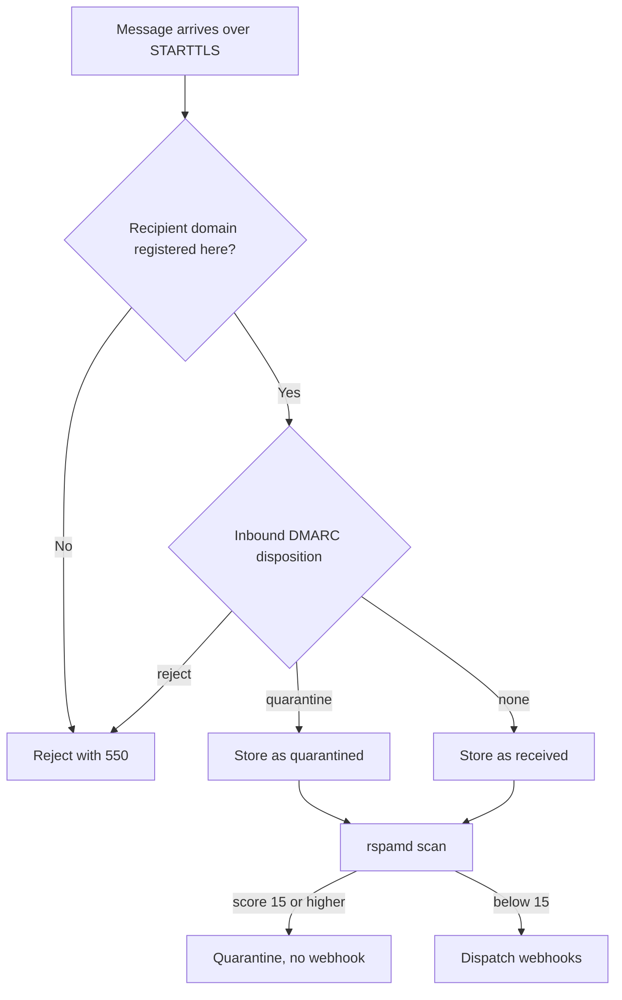

# Security

relay is communication infrastructure. Your application trusts relay with
message content and DNS authority for your domains. This page explains the
mechanisms that make that trust safe. Every claim here describes behavior
that relay implements today.

## Account security

relay authenticates you through GitHub OAuth. relay stores your GitHub
identity and your email address, but never a password. GitHub proves who you
are on every sign-in. A password leak from the relay database is impossible
by design, because relay holds no passwords.

Sign-in creates your personal organization on the first use. An organization
owns domains, SMTP credentials, webhooks, and messages. relay isolates
organization data at the database level. Every query of org-owned data filters on the
organization, so one organization cannot read the messages of another
organization.

relay also blocks domain hijacking between organizations: a domain that
overlaps a domain of another organization cannot be registered. relay reserves subdomains
of the managed sender domain for the platform. relay enforces
both rules before it saves the domain.

## SMTP credential security

Your application submits email over the relay submission host with an
SMTP credential. A credential belongs to exactly one organization. Each
credential carries a visible key prefix, so you can tell credentials apart in
the dashboard and in support conversations.

relay does not store API keys in plain form. relay stores a key prefix and a
key hash, and only the hash can answer an authentication attempt. The plain
API-key value is visible once at creation and never again. Authentication
looks up credentials by organization and prefix and verifies the key hash.

Any credential can carry a `hold` flag. A held credential fails
authentication immediately without deletion. This buys you a pause button for
suspicious activity.

Create one credential per application, and give each one a name. The stored
message records the credential that submitted it, so every send is
attributable. If a key leaks, delete it in the dashboard, then create a
replacement. Rotating credentials changes no message content.

## Accountability for every message

Each stored message records:

- the credential that submitted it,
- whether the submission arrived over TLS,
- sender, recipient, and subject,
- the full SMTP transcript of every delivery attempt.

Support conversations therefore start from facts: which key sent what, and
how the remote server answered.

## Signing key protection

A private signer key must stay secret. relay generates each signing key at
creation, encrypts it with Fernet under the platform KMS key, and stores only
the ciphertext. The database never contains a private key in plain form, and
decryption happens only where message delivery needs the key material.

DKIM public keys are public by design and appear in DNS. Webhook public keys
appear in the dashboard in `whpk_` format for you to verify deliveries. See
<a href="">Webhooks</a> for the
verification procedure.

## Transport security

relay accepts submissions only over TLS, on port 465 (implicit TLS) or 587
(STARTTLS enforced before any other exchange). relay delivers through
STARTTLS and enforces MTA-STS for recipient domains that publish a policy.
The dashboard records whether each message traveled over TLS, so silent
downgrades do not exist.

## Inbound protections

The MX server runs a sequence of gates before a message reaches your
webhook:

A reject disposition returns an SMTP failure to the sending server inside the
SMTP transaction. The message never enters the platform. A high spam score
quarantines the message instead of delivering it, and the dashboard shows
both with their scores.

## Error monitoring and secrets

All relay processes report errors to Sentry, and reporting is off by default.
The reports carry no message bodies, no tokens, and no credentials. relay
reads secrets from its environment and never writes them to the database.
Never send secrets inside email messages. Use the dashboard's credential
management instead.

## Related pages

- <a href="">Encryption</a>. TLS on
  every hop and key material at rest.
- <a href="">Data privacy</a>.
  Hosting, retention, and data minimization.
- <a href="">Webhooks</a>. Delivery
  verification code examples.
