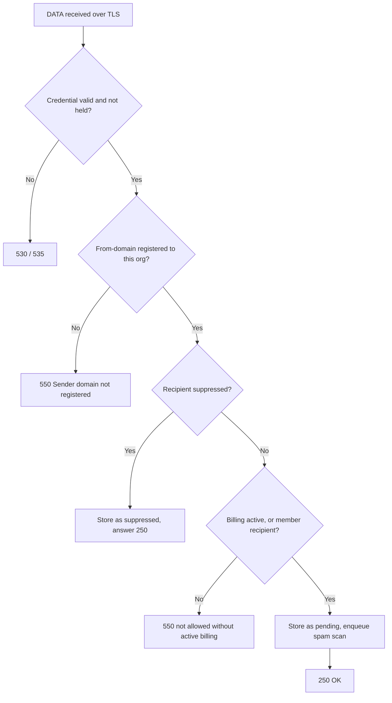
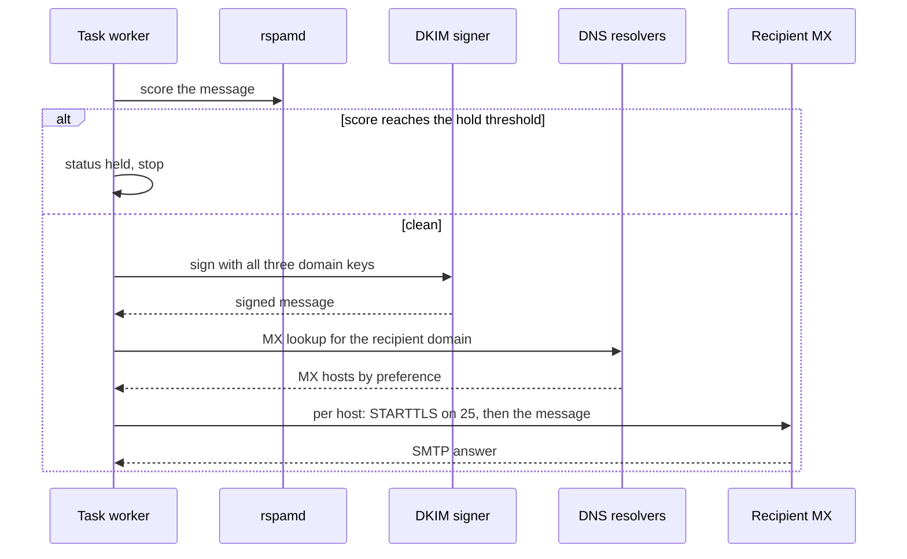

# Sending

This page covers the interface between your application and relay: how to
connect, what relay checks on submission, and what happens to a message after
relay accepts it.

## What you need

- An SMTP credential from the dashboard. The username is your organization
  slug, and the password is the API key.
- A sender domain registered to your organization, whose From-address you
  use. The managed sender domain works from the first minute.
- A receiver address that is not on your suppression list.

## Connect and authenticate

| Port | Security                               | Use                                |
| ---- | -------------------------------------- | ---------------------------------- |
| 465  | Implicit TLS from the first byte       | Preferred submission path          |
| 587  | STARTTLS required before AUTH and DATA | Corporate networks that filter 465 |

relay speaks SMTP AUTH PLAIN. The username is the organization slug, and the
password is an SMTP credential key. No session and no TLS means no AUTH: the
server refuses AUTH over plaintext on port 587.

The submission exchange:

```text
openssl s_client -starttls smtp -connect smtp.relay.example.com:587
  EHLO your-app.example.com
  AUTH PLAIN <base64 of \0org-slug\0api-key>
  MAIL FROM: <billing@acme.com>
  RCPT TO: <kim@example.net>
  DATA
  <message with headers and body>
  .
```

## The acceptance checks

relay runs its checks inside the SMTP transaction and answers with the
final acceptance code:



Notes on the rules:

- The From-domain must resolve to a domain of your organization, matching by
  root domain and organization. Subdomain From-addresses therefore work
  without extra configuration.
- A suppressed recipient is not an error. relay stores the message with the
  suppressed status so the audit trail stays complete.
- Without active billing, relay accepts only messages addressed to members
  of the organization, so you can always test on yourself.

## The delivery pipeline

After the 250 answer, a task worker takes over:



Important details of the pipeline:

- **Signing covers the message as stored.** relay signs with the private
  keys of the sender domain for RSA-2048, RSA-1024, and Ed25519 at once.
  All signatures cover the same headers: From, To, Subject, Date,
  Message-ID, and `Feedback-ID`.
- **Customers' messages carry a platform cosign.** relay cosigns with the
  keys of the platform domain. relay also sets a `Feedback-ID` header with
  its own token. This token replaces a customer-supplied `Feedback-ID`, so
  complaint reports echo relay's key and the complaint maps to one message.
- **The envelope differs from the From header.** The Return-Path becomes
  `bounce+{message-id}@{sender-subdomain}`, so each bounce identifies one
  message and the envelope domain aligns with your DKIM.
- **EHLO identifies the relay sending host**, whose name matches its
  reverse DNS record. Receivers grade that consistency.
- **Enforced MTA-STS.** For recipient domains with a policy, relay skips
  hosts the policy does not permit. See
  <a href="">Encryption</a>.
- **relay tries every MX host** in preference order and records one
  transmission per attempt, with the SMTP answer.

## Message and attempt statuses

The message carries one status. Every attempt carries its own:

| Message status | Meaning                                             |
| -------------- | --------------------------------------------------- |
| pending        | Stored, spam scan or delivery not finished yet      |
| held           | rspamd held the message, and it never left          |
| sent           | At least one attempt ended with success             |
| bounced        | A recipient server rejected the message permanently |
| suppressed     | The recipient is on the suppression list            |
| failed         | relay cannot deliver, the transcript shows why      |

The Transmission list per message shows every attempt: the MX host context,
the SMTP status code, the answer text, and whether TLS was in use.

## Bounce handling

On a permanent 5xx rejection relay records the bounce and adds the
recipient's address as a suppressions entry with the reason *bounce*.
Suppressed addresses reject silently on later submissions. There is no
automatic removal. A human can release an address again in the
dashboard. Manual entries can carry reason *manual*.

## A minimal client

Python with the standard library:

```python
import smtplib, ssl

with smtplib.SMTP("smtp.relay.example.com", 587) as server:
    server.starttls(context=ssl.create_default_context())
    server.login("acme", get_env("RELAY_API_KEY"))
    server.sendmail(
        "billing@acme.com",
        ["kim@example.net"],
        "From: billing@acme.com\r\n"
        "To: kim@example.net\r\n"
        "Subject: Invoice\r\n"
        "\r\nYour invoice is ready.\r\n",
    )
```

Libraries that speak SMTP natively set the same four things: host, port,
STARTTLS, and the credential pair.

## Related pages

- <a href="">Deliverability</a>.
  The DNS records behind this pipeline.
- <a href="">Reliability</a>.
  Retries, attempts, and monitoring.
