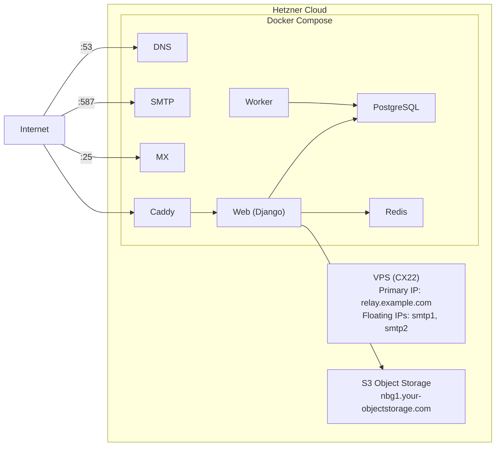

# Deploy relay on Hetzner with Terraform

Provision a Hetzner Cloud server with multiple IPs for email
deliverability, Hetzner S3 Object Storage for file storage, and deploy
relay via the-box (Docker Compose) with GitHub Actions CI/CD.

## Architecture



Each IP has its own PTR record. If one SMTP IP gets blacklisted, switch
DNS to the backup IP and update `RELAY_DNS_SMTP_IPS`.

## Prerequisites

- **Terraform** (`brew install terraform`)
- **A Hetzner Cloud API token** (Console -> Security -> API Tokens)
- **Hetzner S3 credentials** (Console -> Object Storage -> Credentials)
- **Your SSH public key** (for root access)
- **GitHub CLI** (`gh`) installed and authenticated
- **dotenvx** (`npm install -g @dotenvx/dotenvx`)
- **A DNS domain** with A record access

## Step 1 - Provision with Terraform

```bash
cd terraform

cat > terraform.tfvars <<EOF
hcloud_token    = "<your-hetzner-api-token>"
hostname        = "relay.example.com"
server_type     = "cx22"
server_location = "nbg1"
ssh_public_keys = ["$(cat ~/.ssh/id_ed25519.pub)"]
smtp_floating_ip_count = 2

# S3 credentials from Hetzner Console -> Object Storage -> Credentials
s3_access_key  = "<your-s3-access-key>"
s3_secret_key  = "<your-s3-secret-key>"
s3_endpoint    = "nbg1.your-objectstorage.com"
# s3_bucket_name is optional; by default it is derived from the hostname
# (bucket names must be unique across all of Hetzner Object Storage)
EOF

terraform init
terraform plan
terraform apply
```

Terraform provisions:

- Hetzner Cloud server (CX22, Ubuntu 24.04) with Docker
- 2 floating IPs for SMTP with PTR records
- S3 bucket on Hetzner Object Storage
- Deployment SSH key pair

Note the outputs:

```bash
terraform output -raw server_ip
terraform output -raw ssh_private_key > /tmp/deploy_key
terraform output smtp_ips
terraform output s3_endpoint_url
```

## Step 2 - Configure DNS

```
A  relay.example.com    <server_ip>
A  smtp1.example.com    <smtp_ips[0]>
A  smtp2.example.com    <smtp_ips[1]>
A  mx.example.com       <server_ip>
A  dns.example.com      <server_ip>
A  *.relay.example.com  <server_ip>
```

PTR records are set by Terraform automatically.

## Step 3 - Set up the-box GitHub integration

```bash
SERVER_IP=$(cd terraform && terraform output -raw server_ip)
SSH_PRIVATE_KEY=$(cd terraform && terraform output -raw ssh_private_key)

gh variable set SSH_HOSTNAME --body "$SERVER_IP"
gh variable set SSH_KNOWN_HOSTS --body "$(ssh-keyscan "$SERVER_IP")"
gh variable set HOSTNAME --body "relay.example.com" --env production
echo "$SSH_PRIVATE_KEY" | gh secret set SSH_PRIVATE_KEY
```

## Step 4 - Encrypt production environment

```bash
S3_ENDPOINT=$(cd terraform && terraform output -raw s3_endpoint_url)
S3_BUCKET=$(cd terraform && terraform output -raw s3_bucket_name)

dotenvx set HOSTNAME "relay.example.com" -f .env.production -p
dotenvx set POSTGRES_PASSWORD "$(python3 -c 'import secrets; print(secrets.token_urlsafe())')" -f .env.production
dotenvx set REDIS_PASSWORD "$(python3 -c 'import secrets; print(secrets.token_urlsafe())')" -f .env.production
dotenvx set RELAY_DNS_SMTP_IPS "$(cd terraform && terraform output -json smtp_ips | jq -r '.[0]')" -f .env.production
dotenvx set GITHUB_CLIENT_ID "<oauth-client-id>" -f .env.production
dotenvx set GITHUB_CLIENT_SECRET "<oauth-client-secret>" -f .env.production
dotenvx set SECRET_KEY "$(python3 -c 'import secrets; print(secrets.token_urlsafe())')" -f .env.production
dotenvx set AWS_S3_ENDPOINT_URL "$S3_ENDPOINT" -f .env.production
dotenvx set AWS_S3_ACCESS_KEY_ID "<s3-access-key>" -f .env.production
dotenvx set AWS_S3_SECRET_ACCESS_KEY "<s3-secret-key>" -f .env.production
dotenvx set AWS_STORAGE_BUCKET_NAME "$S3_BUCKET" -f .env.production
dotenvx set AWS_S3_REGION_NAME "nbg1" -f .env.production
dotenvx set AWS_S3_ADDRESSING_STYLE "path" -f .env.production

dotenvx get DOTENV_PRIVATE_KEY_PRODUCTION -f .env.keys | gh secret set DOTENV_PRIVATE_KEY_PRODUCTION

git add .env.production
git commit -m "Add encrypted production environment"
```

## Step 5 - Deploy

```bash
git push origin main
```

CI builds and pushes the image to ghcr.io, then the-box deploys via SSH.

## Step 6 - Verify

```bash
curl https://relay.example.com/health/
openssl s_client -connect smtp1.example.com:587 -starttls smtp
dig MX example.com @dns.example.com
```

## IP reputation and blacklist rotation

If an SMTP IP gets blacklisted:

1. Update DNS: `A smtp.example.com <smtp_ips[1]>`
1. Update env: `dotenvx set RELAY_DNS_SMTP_IPS "<smtp_ips[1]>" -f .env.production -p`
1. Push: `git add .env.production && git commit -m "Switch SMTP IP" && git push`
1. Monitor at [MXToolbox](https://mxtoolbox.com/blacklists.aspx)
1. Keep the blacklisted IP assigned but unused until delisted

## Troubleshooting

- **Containers not starting**: `ssh root@<server_ip> docker compose ps`
- **Floating IPs missing**: `ssh root@<server_ip> ip addr show eth0`
- **SMTP refused**: `ssh root@<server_ip> docker compose logs smtp`
- **TLS not issuing**: `dig relay.example.com` then `ssh root@<server_ip> docker compose logs caddy`
- **S3 access denied**: Verify credentials in `.env.production` match Hetzner Console
